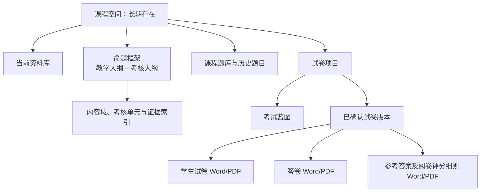
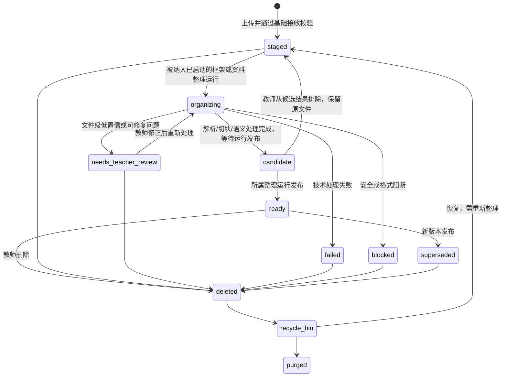
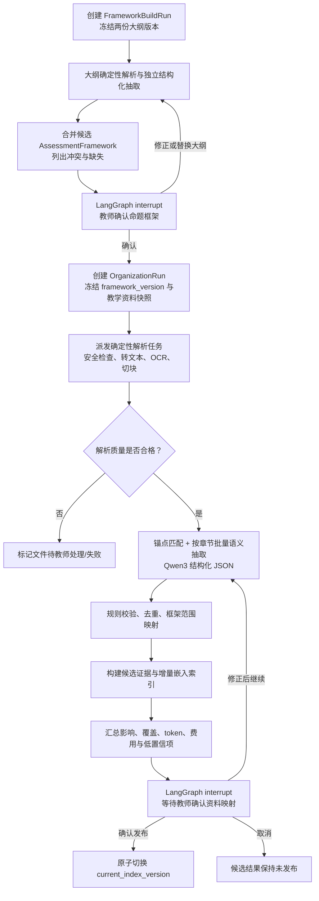
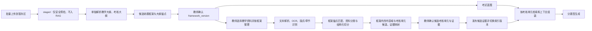
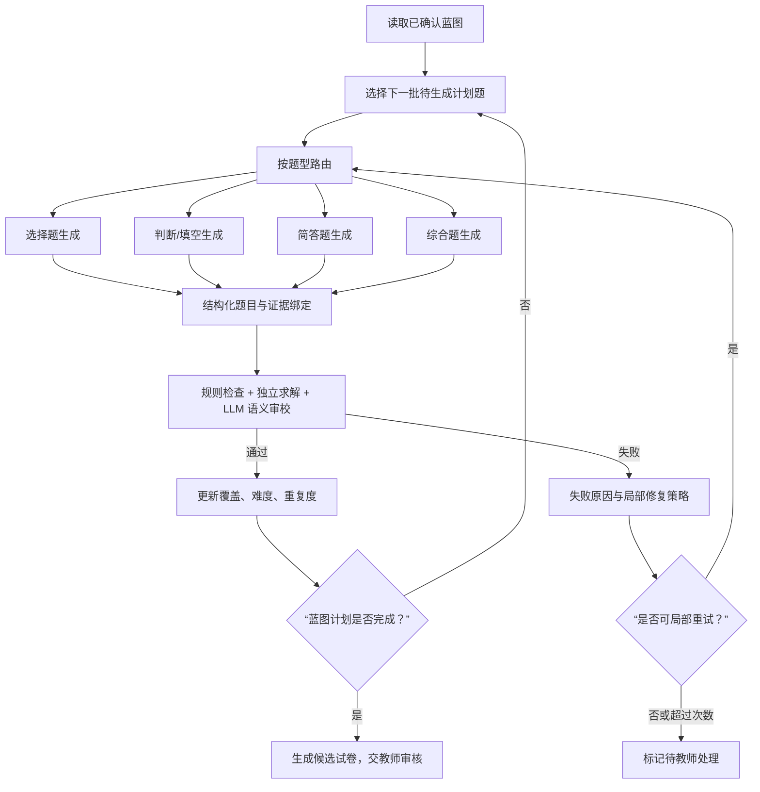
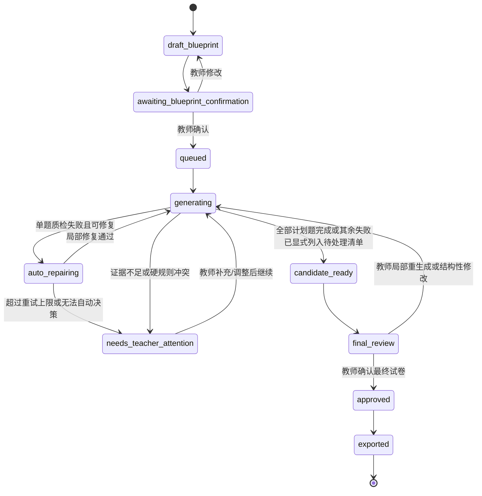
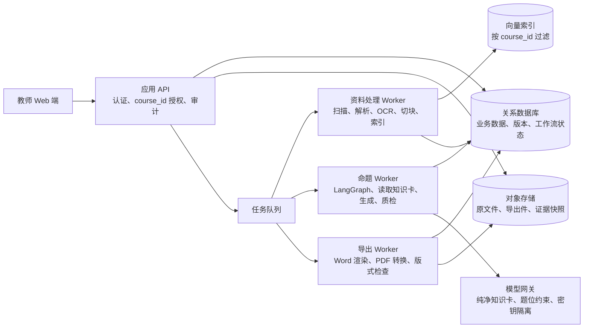

# AI 期末试卷命题系统设计

> 状态：已确认的设计基线  
> 版本：2.3  
> 更新日期：2026-08-14  
> 适用范围：高校课程的纸质期末试卷命题、审核与 Word/PDF 导出

## 1. 目标与边界

本系统帮助高校教师根据课程资料生成可打印的期末试卷。它不是“向大模型提一个问题并获得整卷”的工具，而是一套可控、可追溯、可审核的考试资产生产流程。

系统的核心目标是：在课程大纲与教学资料的约束下，先形成教师确认的考试蓝图，再按题型分批生成题目，并通过质量检查、局部重生成和人工编辑，最终导出正式的学生试卷与参考答案及阅卷评分细则。

本期明确不做：学生管理、班级管理、试卷发布、在线考试、在线阅卷，以及对图片、截图、流程图、图表和图像中文字的视觉理解或基于其内容的自动命题。系统支持对可提取文本的代码/配置片段进行受控补全题生成与静态校验；教师仍可在编辑器中手工插入图片、表格、公式、流程图和绘图区域。

## 2. 核心设计原则

1. **考核大纲主导，教学大纲校验，课程资料供事实。** 考核大纲先形成期末考试的范围、章节权重、题型比例、能力要求和排除项，是命题框架主骨架；教学大纲用于核对是否实际讲授、教学目标和讲授深度，不与考核大纲平权扩张范围。两份大纲分别解析并由教师确认后形成版本化命题框架。每个教学材料或作业文件的语义整理请求必须携带去来源的框架摘要；资料只能在考核范围内补充本课程实际讲授的事实、条件、案例和评分依据，不能反向创造考试范围。
2. 课程隔离。每门课程拥有独立的资料库、内容域与考核单元目录、题库和试卷记录，任何检索和生成都不得跨课程混用资料。
3. 不全量投喂。原始文件可以长期保留，但只有教师主动选择并执行“整理课程资料”的文件才进入解析、内容域/考核单元抽取和索引；出题模型只接收当前题位需要的已确认知识卡，不接收原始证据正文和来源关系。
4. 结构化优先。教师看到的是富文本试卷；系统内部始终保留题目、答案、评分点、来源证据、难度和版本等结构化数据。
5. 人在回路。AI 生成的内容域/考核单元目录、考试蓝图和题目都可被教师确认、修改或拒绝。最终导出只能基于教师已确认的试卷版本。
6. 局部修复。发现一题不合格时，只回退并重生成该题或其选项/评分细则，不重做整卷。
7. 可审计和可过期。每道 AI 题可追溯到课程资料；资料删除后保留必要证据快照并明确标记“来源已删除，可能过时”。
8. 最小权限。课程资料、题目、试卷、导出文件和模型调用均以课程空间为安全边界；没有明确授权的用户、管理员或后台任务均不能读取其内容。
9. **可考能力优先。** 原始资料中的句子、操作、文件名或参数不是天然考点。系统先识别课程内容域，再将其转化为具有明确认知动作、可答边界和可评分表现的考核单元；只有已确认的考核单元才能直接驱动蓝图和出题。
10. **来源关系与知识内容分字段保存。** 资料整理模型需要接收文件名、页码/幻灯片号、章节标题、内容块 ID 和原文，以便将候选知识点准确定位回资料。入库时同时保存纯净知识卡和 `knowledge_point ↔ evidence` 来源关系；教师可查看来源，出题模型只能接收当前题位的纯净知识卡，不接收来源关系、证据 ID 或原文。

### 2.1 资料提炼与命题的强制数据边界

```text
考核大纲 → 考试范围、权重、题型、能力与排除项（主骨架）
教学大纲 → 已讲内容、课程目标与教学深度（校验/补充）
                         ↓ 冲突检测 + 教师确认
                 版本化命题框架（去来源摘要）
                         ↓
单份教学材料或作业（原文 + 文件名 + 页码/章节 + 资料角色）
  → 解析/去指令噪声 → 仅提取框架内的知识卡候选 → 教师确认并入库
                                                       ├→ 来源关系（教师查看/审计）
                                                       └→ 纯净知识卡（出题模型读取）
```

纯净知识卡至少包含：考核单元名称、可考范围、认知动作、重要度与一条以上纯净的 `assessable_content`。考核单元与框架锚点、证据片段之间的关系由后端独立关联表保存，不拼入知识卡字段。`assessable_content` 必须是可独立判断真伪或可形成评分点的课程事实，不能是“按某手册完成”“安装/下载/打开/运行/截图/提交”“复制某条命令”“某实验第几步”等指令。

生成试卷时，系统按蓝图题位确定一个已确认知识点，直接读取该知识点的 `name + assessable_content + cognitive_level + difficulty + question_type` 形成生成输入；来源关联仅在生成完成后由后端挂回题目，供教师点击“查看依据”，不得拼入模型请求。此处不再从原始证据库做一次自由语义检索，以免重新引入文件结构或绑定到相似但不属于该知识点的片段。

如果某项资料内容只能支撑操作执行而不能转写为原理、约束、比较、诊断或设计依据，则它应被标为“素材/非考核内容”，而不是强行成为知识点。若大纲明确要求掌握某项配置，知识卡应表述参数的作用、约束和取舍，而不是复现某文件或实验指导书中的固定设置。

## 3. 产品对象与层级



### 3.1 课程空间

课程空间是长期可复用的资料与知识边界，例如“SK3020 大模型调优与部署技术”。一名教师可以拥有多门课程；每门课程相互隔离。

资料只在课程空间上传一次，可用于不同年级、班级或学期的多次命题。系统不建立按学期复制资料的资料库。学年学期仅作为试卷项目的归档标签，例如“2026-2027-I 期末卷”。

### 3.2 试卷项目

试卷项目是一份独立的命题工作：包含本次考试蓝图、生成过程、教师编辑记录、最终试卷和导出文件。一个课程可有任意多个试卷项目。

已确认或导出的试卷必须冻结其结构化内容、最终蓝图和引用证据快照；此后课程资料变更或被删除，不得改写历史试卷。

### 3.3 权限模型与安全审计

第一期只定义三个主体，避免在尚未需要协作时引入复杂角色：

| 主体 | 默认权限 | 明确限制 |
|---|---|---|
| 课程所有者（教师） | 创建/管理本人课程空间；上传、查看、删除和恢复本课程资料；确认内容域、考核单元/蓝图；生成、编辑、导出和删除本课程试卷项目 | 不能访问其他教师课程；不能直接访问平台密钥、其他租户日志或已物理清除文件 |
| 平台管理员 | 管理账号、课程空间元数据、院校模板、题型模板、运行健康和存储配额 | 默认不可阅读教师资料、题干、答案、证据或导出文件；确需排障时须由教师一次性授权、说明目的、限定时效并产生审计记录 |
| 后台服务账户 | 在已授权的课程范围内执行解析、索引、生成、导出与定时清理 | 不可登录教师界面；不跨课程查询；只持有完成当前任务所需的短期凭证 |

所有资源（文件、解析文本、内容域、考核单元、证据片段、题库题、蓝图、生成运行、试卷版本、导出件）必须含 `course_id` 和所属教师 ID。每次读取、写入、检索、模型调用和导出都在服务端校验资源归属；前端传入的 `course_id` 或文件 ID 不能被信任为授权依据。

系统建立不可修改的审计事件：登录/登出、课程创建、文件上传/解析/删除/恢复/清除、内容域/考核单元确认、蓝图确认、模型生成和使用的证据 ID、教师编辑、导出、管理员受控访问和权限拒绝。审计日志默认只保存操作元数据（操作者、资源 ID、时间、动作、结果和原因），不保存原始题干、答案或教学资料全文。

### 3.4 模型调用、数据最小化与密钥管理

资料和试卷属于教学与考试敏感内容。模型调用必须按阶段分离：资料整理模型接收当前单个文件中的一个章节或相邻小节，以及文件名、页码/幻灯片号、章节标题、内容块 ID、必要的大纲锚点和既有考核单元摘要，用于提炼纯净知识卡并建立来源关系；出题模型只接收当前计划题对应的纯净知识卡和必要的蓝图、题型约束；质检模型只接收待检查题目及其知识卡。不得把来源字段、证据 ID、原始证据正文、整门课程资料、历史试卷或任意课程目录发送给出题模型。

首次在课程空间启用 AI 生成时，系统向教师明确说明：哪些资料可能发送给所选模型服务、用于何种目的、是否用于供应商训练（应选择默认不用于训练的服务配置）、保存多久以及如何撤销。教师确认后才创建该课程的模型使用授权；教师可在课程设置中关闭 AI 调用，此后资料仍可管理但不可自动出题。

模型 API 密钥只保存在受控密钥服务或服务端环境变量中，绝不下发给浏览器、写入试卷、解析日志或提示词。调用使用服务端短期任务凭证，并记录模型提供方、模型版本、区域/部署标识、输入知识卡 ID、由后端关联的证据 ID 列表、输出哈希、调用时间和费用/令牌统计；日志默认不记录完整模型输入输出。外部模型供应商、存储和向量数据库应配置传输加密、静态加密和最小保留期限。

## 4. 课程资料与上传体验

### 4.1 固定上传区 + 批量导入

教师不应逐份文件选择类型。课程空间采用固定资料区，教师先选择“上传到哪个区域”，再一次拖入多个文件或文件夹：

```text
课程空间
├─ 大纲与规则
│  ├─ 教学大纲（通常一个当前生效版本）
│  └─ 考核大纲（通常一个当前生效版本）
├─ 教学资料（批量）
│  ├─ PPT、PDF、Word、教材章节、实验手册
│  └─ 可上传整个章节/周次文件夹
├─ 练习与题库（批量）
│  ├─ 课堂练习、作业、实验题
│  ├─ 往年试卷
│  └─ 标准答案/评分细则
└─ 待分类资料
```

教学大纲和考核大纲在各自区域内只允许一个“当前生效版本”。新文件替换旧文件时保留版本记录，并先使当前命题框架过期；待新框架确认后，再触发受影响内容域、考核单元、资料映射和命题规则的重建。教学资料与练习题允许批量上传。

系统仍可在教师点击“整理课程资料”后对每个文件做自动类型识别，例如识别“答案卷”“练习题”或“普通课件”；当识别结果置信度低、资料区与内容明显冲突、或题目与答案无法配对时，才进入待确认区。该机制用于辅助，而不替代上传区域的明确语义。

### 4.1.1 考核大纲主导、教学大纲配套校验

本系统中教师所说的“教案”即**教学大纲**，不另设“教案”资料类型。教学大纲与考核大纲是配套文件，但命题权威不对等：考核大纲描述期末笔试的可考范围、能力要求、章节权重、题型/分值/时长等硬约束，是命题主依据；教学大纲描述已教内容、章节顺序、课程目标、重点难点与应达到的学习深度，用于验证考核要求是否有教学支撑。二者不与 PPT、实验指导书或练习题混合整理。

系统先从考核大纲提取 `ExamDistributionRule`、标准考核章节、可考范围、能力声明和排除项，再用教学大纲核对相应内容是否讲授、课程目标和教学深度；二者确认后形成 `AssessmentFramework`（命题框架），再整理教学资料与作业。该框架至少包含：课程目标、标准考核章节/内容域树、每个内容域的授课/可考范围、重点与排除项、能力层次、章节权重、题型和卷面约束，以及能定位到原文的 `FrameworkAnchor`（大纲锚点）。它是后续考核单元、资料映射、覆盖检查和蓝图的共同边界，不是又一份可由模型自由改写的摘要。

```text
考核大纲（独立解析） → 考试规则/范围/权重/能力主骨架 ─┐
教学大纲（独立解析） → 已讲内容/目标/深度校验 ────────┼→ 冲突清单与候选命题框架
                                                       → 教师确认 → 冻结框架版本
                                                                            ↓
                                                 教学资料与作业按框架映射、筛选与入库
```

两个大纲文件必须各自独立解析；合并节点只读取它们已结构化的条款、章节和定位锚点，不把两份原文或全课程资料拼接给模型。大纲中的冲突不得静默“取平均”或由模型臆断：考核大纲对可考/不考范围、题型、分值、时长和明确能力要求拥有硬约束优先级；教学大纲用于确认是否实际教学、课程目标和内容深度。系统列出冲突位置、影响范围和建议处理，必须由教师确认。

命题框架有以下准入状态：

| 框架状态 | 前提 | 可执行动作 |
|---|---|---|
| `absent` | 尚未确认任一当前大纲 | 只能上传/预览文件；教学资料不能整理为候选考核知识库 |
| `provisional` | 已确认教学大纲或考核大纲中的至少一份 | 可按该临时框架预整理教学资料；所有映射显示“框架未完整”，只能生成候选预览，不能发布可出题索引、创建蓝图或生成试卷 |
| `awaiting_framework_confirmation` | 两份大纲均已解析，或大纲变更后已形成候选合并结果 | 教师复核范围、权重、目标、冲突和排除项；不能创建蓝图 |
| `confirmed` | 当前教学大纲、当前考核大纲及其合并框架均经教师确认 | 可发布与该框架绑定的资料索引、创建蓝图和生成试卷 |
| `outdated` | 任一当前大纲被替换、删除或被教师退回 | 不得新建蓝图或启动新生成；需重新构建并确认框架 |

因此，教师可以在仅有一份已确认大纲时提前整理教学资料，减少等待时间；但只有**两份当前大纲和合并命题框架都已确认**，系统才允许构建考试蓝图和生成期末试卷。

### 4.2 文件夹层级作为弱标签

教师可保留现有目录结构并整体上传，例如：

```text
第3章-监督微调/
├─ 第8讲-SFT.pptx
├─ 第9讲-LoRA.pptx
├─ 实验8-SFT训练.pdf
└─ 章节练习.docx
```

文件夹名被视为“章节/周次候选标签”，文件先继承该标签；系统再用文档标题和正文与大纲章节、内容域做语义匹配。两者冲突时，只要求教师在文件夹或章节层级确认一次，不要求逐文件标注。

### 4.3 考试规范权威与课程事实证据

系统不能把“决定考什么的规范权威”和“决定答案是什么的事实证据”压成一条来源排名。两类依据必须分别满足：

```text
考试规范权威：教师对当前试卷的显式覆盖决定
  > 考核大纲的范围、权重、能力和卷面硬约束
  > 教学大纲的已讲内容、目标和深度校验
  > 教学材料、练习题和历史卷提供的覆盖/风格信号

课程事实证据：教师确认的当前课程知识卡或修订
  > 教师明确确认的教材、课件、讲义和参考材料内容
  > 当前普通教学资料中经整理、映射和教师确认的事实
  > 具有教师确认答案/解析/评分细则且与当前资料一致的作业或题目
  > 无答案作业、学生答案、外部题库（不能建立正确事实）
```

一条题目必须同时通过两个独立门：`scope_gate` 要求目标考核单元由考核大纲锚点准入，并经教学大纲验证已教范围和深度；`fact_gate` 要求题目中的专业前提、答案与评分点可由当前有效的纯净知识卡推出，且知识卡具有允许作为事实/评分依据的课程资料来源。考核大纲只写“应掌握某技术”时，它足以决定该内容可考，但不足以提供该技术的具体定义、参数、答案或评分细节；这些细节必须来自教学资料或教师确认内容。

练习题、作业和历史卷按是否具有教师确认的答案依据分级使用，均不能覆盖考核大纲、扩大考试范围或被模型原样复制：

- **有教师确认的标准答案、解析或评分细则：** 在映射到已确认考核单元后，可作为 `fact_or_definition`、`answer_or_rubric_basis` 或 `example_or_material` 证据；仍需与教学资料交叉核对，不能仅凭一份旧题形成新的考试事实。
- **没有教师确认答案的平时作业/练习：** 只证明该内容“教过、练过”，用于题型、场景、认知层级、常见错误和难度校准；其题干陈述、学生答案和模型推断不得作为正确答案或评分事实。
- **往年试卷、外部题库或来源不明练习：** 默认仅作为风格参考、难度校准和重复检测；教师逐题确认后才能升级为课程事实或评分依据。

### 4.4 删除、更新与过期处理

教师可从课程空间删除旧资料并上传新资料。删除后：

- 文件停止参与未来的检索、内容域/考核单元抽取和新试卷生成；
- 与其关联的内容域、考核单元、当前草案蓝图和未完成题目会标记“受影响，需重新确认”；
- 下次生成前，教师必须确认受影响的考核单元、章节权重或蓝图内容；
- 已生成试卷保留少量证据摘录、来源文件名和删除时间，但显示“来源已删除，内容可能过时，不建议直接复用”；
- 历史题不会被删除或自动改写。

教学大纲或考核大纲的替换、删除、恢复与普通教学资料不同：它会使依赖该文件的 `AssessmentFramework` 立即变为 `outdated`，并使当前可用于**新建**蓝图/生成的索引、未确认蓝图和未完成生成运行标记为“命题依据已变更，需复核”。系统保留旧框架、旧索引及其证据映射供历史追溯，但禁止它们继续用于新卷；重新上传或恢复大纲后必须走“重新构建命题框架 → 教师确认 → 重映射受影响教学资料 → 发布新索引”。

重映射不等于重解析全部资料：没有变更的教学资料可复用其原始解析文本、`ContentBlock`、去重结果和嵌入，仅针对受影响的框架锚点重新执行章节匹配、考核单元关联、证据角色校验和覆盖计算。已确认或导出的历史试卷始终冻结在原 `assessment_framework_version`、蓝图和证据快照上，显示“命题依据已更新”但不被重写。

### 4.5 上传安全与文件处理边界

上传资料是不可信输入。首期只接受 PDF、DOC/DOCX、PPT/PPTX 等课程资料格式；拒绝可执行文件、脚本、压缩包、宏启用 Office 文件和伪装扩展名。系统同时检查文件扩展名、实际 MIME 类型、大小限制和恶意文件扫描结果，不能只相信文件名。

文件解析在隔离环境完成：不执行 Office 宏、嵌入对象、外部链接或文档内脚本；解析器不得拥有网络访问、其他课程文件权限或模型平台密钥。加密、损坏、无法提取文本或扫描失败的文件进入“待教师处理”，不能静默入库或参与生成。

资料删除使用两阶段策略：删除操作立即从当前资料库、检索索引和后续生成中移除该文件；原始文件进入仅课程所有者可见的回收区，默认保留 30 天后物理清除。教师可在保留期内恢复；清除后，历史试卷仅保留已冻结的最小证据快照、文件名、哈希、删除时间和“来源已删除”标记，不保留原文件供新试卷使用。

### 4.6 资料解析生命周期与异常处理

上传成功不等于资料已经开始整理，更不等于资料已经可用于出题。上传阶段只做文件安全预检、哈希计算、大小/MIME 校验和对象存储写入，不调用大模型、不抽取内容域或考核单元、不生成嵌入、不写入当前课程的 RAG 索引。教师必须主动选择大纲并点击“构建命题框架”，或在已有框架后选择教学资料并点击“整理课程资料”，系统才创建相应的可追踪运行。

为避免实现中混淆，**文件版本状态**与**运行状态**是两套独立状态机：文件状态描述一个 `CourseMaterialVersion` 当前能否作为证据；运行状态描述一次 `FrameworkBuildRun` 或 `OrganizationRun` 的协调整理进度。一个运行可以处理多个文件，而一个文件也可以在不同版本中进入多次运行。



| 文件版本状态 | 含义 | 是否可作为新题证据 | 教师可执行操作 |
|---|---|---|---|
| `staged` | 文件已上传并通过基础接收校验，但尚未被已启动的框架或资料整理运行处理/发布；不产生模型调用和 RAG 数据 | 不可以 | 预览文件元数据、删除、选择后处理 |
| `organizing` | 文件属于正在运行的整理任务；正在安全扫描、解析、OCR、切块或候选构建 | 不可以 | 查看步骤进度、取消整个运行或删除文件 |
| `candidate` | 文件已产生候选结构/证据，等待教师确认其所属整理运行 | 不可以 | 查看候选、排除、修正后重整 |
| `ready` | 文件的结构、资料区、内容域/考核单元归属和索引已随所属运行发布，且关联命题框架当前有效 | 可以 | 查看、移动资料区、替换、删除 |
| `needs_teacher_review` | 内容可部分提取，但存在低置信分类、章节冲突、答案配对失败或文本覆盖不足等问题 | 默认不可以；教师修正后重新进入整理 | 查看定位、确认/更正分类、重试、忽略、删除 |
| `failed` | 解析/OCR/索引发生技术失败 | 不可以 | 查看错误、重试、重新上传、删除 |
| `blocked` | 文件不安全、不受支持、加密、恶意扫描失败或违反大小/格式限制 | 不可以 | 查看原因、上传可用副本、删除 |
| `superseded` | 已被同资料区的新版本替换 | 不参与新题生成 | 查看历史、恢复为暂存版本、删除 |
| `deleted/recycle_bin/purged` | 已删除、在回收期或物理清除 | 不可以 | 保留期内恢复；清除后不可恢复 |

`FrameworkBuildRun` 的状态为：`draft`、`queued`、`running`、`awaiting_teacher_confirmation`、`confirmed`、`cancelled`、`failed`；它只管理大纲解析、框架合并与教师确认。`OrganizationRun` 的状态为：`draft`、`queued`、`running`、`paused_budget_limit`、`awaiting_teacher_confirmation`、`publishing`、`published`、`cancelled`、`failed`。其中 `paused_budget_limit` 表示已到 token/费用预算上限，保留候选数据但不再继续调用模型；教师可减少文件范围后新建运行，或明确批准一次有审计记录的预算追加后恢复。`awaiting_teacher_confirmation` 只表示整理已完成且等待教师决定发布/修改/取消，不表示预算不足。只有其冻结的 `assessment_framework_version_id` 仍为 `confirmed` 时，`publishing → published` 才能成功并原子切换课程当前有效索引；取消、失败、仅绑定 `provisional` 框架、或未确认的候选数据均不得污染当前 RAG。

系统必须保存不可变的 `file_hash`、解析器版本、解析时间、原文件页数/幻灯片数、成功提取文本的页数/幻灯片数、可定位片段数、检测到的标题层级、资料类型置信度和错误代码。重复文件以哈希识别：同一课程内上传完全相同的文件时，默认复用已有解析结果并提示教师选择“引用现有资料”或“作为独立副本保留”；跨课程不得复用文件内容或解析文本。

对于文本型 PDF、PPT、Word，系统提取标题、正文、页码/幻灯片号和可用结构。**P1 默认只支持带可提取文本层的 PDF、PPT 和 Word；扫描型 PDF/OCR 作为 P1.1 的独立增量能力，不是 P1 发布门槛。** 启用后，扫描型 PDF 可尝试仅用于识别文字的 OCR；OCR 不等同于图像理解，图表、公式、流程图、截图与手写内容不被解释为命题事实。OCR 输出若文本覆盖率、语言置信度或章节识别低于课程配置的最低门槛，文件必须进入 `needs_teacher_review`，不能自动进入证据库。

资料更新、替换或恢复后，文件先回到 `staged`，不自动进入当前索引。教师点击整理后，系统只处理本次选中的文件及受影响的考核单元和索引；已冻结的历史试卷永不重算。系统需要清楚提示“本次变更将影响 X 个考核单元、Y 个草案题位、Z 份未确认试卷项目”，由教师确认整理结果后再提交索引切换。

### 4.7 主动整理、命题框架与候选入库

课程资料页必须将“上传”“构建命题框架”和“整理教学资料”设计为三个明确动作，且顺序不可颠倒：

1. **上传暂存。** 教师向固定资料区批量上传文件或文件夹。系统只执行安全预检、文件哈希、重复文件提示和对象存储写入，文件显示为 `staged`。暂存文件不参与内容域/考核单元统计、关键词索引、向量索引、题目生成或历史题相似度比较，因此上传错文件不会污染当前课程知识库，也不会产生模型输入 token。
2. **构建命题框架。** 教师单独选择教学大纲和/或考核大纲，系统创建 `FrameworkBuildRun`：先逐份解析、提取可定位的章节/条款/课程目标/范围/权重/题型规则，再合并为候选 `AssessmentFramework`。一个大纲文件只能影响自己声明的字段；没有某类明确条款时必须保留“未提供”，不能用教学资料、练习题或模型常识填补。教师确认一份大纲后可得到 `provisional` 框架；只有双大纲和合并框架都确认后才能得到 `confirmed` 框架。
3. **选择教学资料并按框架整理。** 只有 `provisional` 或 `confirmed` 框架存在时，教师才能选择教学资料区/文件夹/新增文件创建 `OrganizationRun`。运行冻结 `assessment_framework_version_id` 与文件快照；普通教学资料、练习题、历史卷绝不能替代或修改当前框架。运行期间继续上传的文件不会自动混入本次处理。
4. **整理预览。** 系统完成安全检查、文本解析、结构切分、**框架锚点匹配**、内容角色分类和考核单元候选提取后，展示新增/修改/失效文件、命中的框架章节与锚点、匹配/未匹配/超范围/排除/仅素材证据数量、候选考核单元、低置信问题、预计影响范围和模型调用统计。此时产生的是候选数据，不影响当前可出题资料。
5. **教师确认并发布。** 教师可批量确认、合并、拆分、标记重点/不考、修正框架章节归属、修改认知目标与边界、排除错误文件或仅发布部分结果。首次发布时，教师必须整体确认内容域与考核单元目录以及它们与命题框架的对应关系；后续整理默认只确认本次受影响的文件、锚点、章节、考核单元和证据。只有关联框架为 `confirmed` 且未过期时，系统才可在一个事务中发布目录版本、证据版本和检索索引别名，并将相关文件从 `staged`/`candidate_ready` 进入 `ready`；`provisional` 运行最多保存候选预览，不得切换当前可出题索引。
6. **取消与失败。** 教师取消框架构建或资料整理、模型调用失败、解析失败或确认不通过时，候选框架、候选内容域、候选考核单元、候选证据和候选索引不得被新题检索；原文件仍可留在暂存区，教师可以修正后重新发起。

教学资料的映射结果必须是以下四类之一，并在教师页清晰显示；不能把“提取到了文本”直接等同于“增加了考点”：

| 映射结果 | 含义 | 是否能驱动新考核单元/出题 |
|---|---|---|
| `matched_evidence` | 能支持一个已确认框架内容域或可评分能力，且满足证据准入规则 | 可作为该框架内考核单元的候选证据；发布后可检索 |
| `supplementary_candidate` | 与框架主题相关，但可能补充了框架未明确的细分能力、深度或边界 | 只能待教师明确并入既有范围或扩展框架后使用；不能自动新增考试范围 |
| `material_only` | 对教学有用但仅适合做案例、代码/日志条件、风格参照或课堂背景 | 可作为题干素材/风格参照；不能作为独立考点或答案依据 |
| `unmatched_or_excluded` | 与当前框架无关、超出范围、管理性内容、低质量文本或不安全内容 | 不进入候选 RAG 或新题生成；保留位置和原因供教师查看 |

练习题、题库和历史试卷默认按 `material_only`/`style_reference` 处理：它们可帮助识别本课程表述、难度和题型习惯，或用于重复检测，但不是教学事实和考试范围的权威来源。教师若要将其中的知识内容作为命题依据，必须将其关联到已有框架锚点，并补充来自教学大纲、考核大纲或教学资料的事实/评分证据。

#### 4.7.1 非命题内容清洗与准入门槛

解析结果与可用于命题的证据不是同一集合。进入语义抽取模型和候选 RAG 的 `EvidenceChunk` 必须先通过确定性准入检查，默认采用“宁可少，不污染”的策略：

- 直接排除实验报告封面、报告名称、姓名/学号/班级/日期/教师签名、成绩和诚信声明等模板或个人信息；
- 直接排除提交、截图、运行观察、完成要求、验收说明、作业通知，以及仅有“任务 1/步骤 2/完成某操作”的管理性标题；
- 直接排除孤立的 `config.json`、`model.safetensors`、`tokenizer.json` 等文件名或模型文件清单；若文件名标题下有完整技术解释，保留正文并将其作为普通技术证据，而不是把文件名本身作为考核单元名；
- 仅软件/硬件环境清单、目录或章节编号不作为证据；包含版本兼容、参数关系、原理、流程约束、评价标准或故障诊断事实的正文可以保留；
- 被排除片段保留来源位置、排除原因和统计信息供教师查看，但不发送给整理模型、不写入候选证据和向量索引；
- 模型输出仍需二次校验，拒绝上述管理性名称、纯文件名、通用“实验操作”或编号任务标题；不得因语义调用失败把章节标题自动转换成候选考核单元。失败时保留合格证据并提示教师重试，不能用标题回退污染 RAG。

首期界面应显示“解析块数、合格证据数、排除数及排除原因”，让教师能区分“资料中存在”与“系统允许作为命题依据”。

"主动点击”不意味着所有工作都必须由大模型完成。整理运行先执行不消耗生成模型 token 的确定性步骤（文件校验、文本解析、去重、标题识别、切块、关键词统计和明显非命题内容分类）；需要真实 DeepSeek 配置后，才调用模型完成语义归并、内容域/考核单元候选提取、章节冲突判断或低置信分类；未配置模型时不得用结构标题或其他规则伪造知识点。嵌入计算也只对本次整理运行新增或变更的证据块执行，不重复处理未变化资料。

### 4.8 文件解析、模型角色与 LangGraph 编排

文件整理不是“选一个大模型读取所有 PDF/PPT/Word”。首期采用“确定性解析器为主、专用模型按需补充、语义模型只处理已提取结构文本”的分层方案。模型的价值在于判断和归并，不能替代文件解码、页码定位、表格/代码保真或安全检查。**教学大纲和考核大纲先由独立的框架解析链路处理；只有已确认框架的锚点可作为教学资料语义整理的约束输入。**

| 能力 | 首期推荐组件/默认模型 | 输入与输出 | 是否使用大语言模型 |
|---|---|---|---|
| 格式识别、安全预检与去重 | MIME/文件签名检测、反病毒扫描、SHA-256 | 文件字节 → 安全结果、文件哈希 | 否 |
| 文档转结构化文本 | **Docling** 作为统一转换层；必要时使用格式原生解析后端（PDF 文本层、DOCX、PPTX） | 文件 → 页/幻灯片、标题、段落、列表、表格文字、代码/配置块和定位信息 | 否 |
| 扫描件 OCR（P1.1 启用） | **PaddleOCR** 的当前稳定中文文本识别模型，按版本冻结部署 | 页面图像 → 文字、坐标、识别置信度 | 否；OCR 仅识别文字，不解释图示含义 |
| 命题框架提取与冲突检测 | **Qwen3-32B-Instruct 级别的中文结构化输出模型**，经模型网关调用 | 一份已提取大纲的章节/条款文本 → `FrameworkAnchor[]`、课程目标、范围、能力要求、权重/题型规则及冲突候选 | 是；教学大纲与考核大纲分开调用，随后以结构化字段合并 |
| 章节映射、内容域/考核单元候选、语义归并 | **Qwen3-32B-Instruct 级别的中文结构化输出模型**，经模型网关调用 | 已提取的章节文本 + 大纲锚点 → 符合 JSON Schema 的候选内容域/考核单元/证据关联/置信度 | 是，但只读取小批量结构文本 |
| 证据向量化 | **BGE-M3** 或能力等同的中英双语嵌入模型，本地/私有部署优先 | 单个 `EvidenceChunk` → 向量 | 否（嵌入模型不是生成模型） |
| 检索重排序 | **bge-reranker-v2-m3** 或能力等同的多语种 reranker | 计划题查询 + 约 20 条候选证据 → 有序候选 | 否（判别/排序模型） |

上述组件名称是首期推荐默认值，不应写死在业务逻辑中。系统以 `parser_profile`、`ocr_profile`、`semantic_extractor_model`、`embedding_model`、`reranker_model` 五个可版本化配置项保存实际提供方、模型 ID、部署区域/本地实例、参数和生效日期；更换任一组件时创建新的候选 `index_version`，不得覆盖旧索引或使历史试卷失去可追溯性。

#### 4.8.1 解析与模型调用顺序

系统先构建命题框架，再整理教学资料。两个阶段都遵循“一文件一任务；一次模型请求不混合多个文件”的规则，文件之间可并行：

```text
阶段 A：命题框架（大纲先行）
教学大纲：安全预检 → 确定性解析 → 章节/目标/重点提取 → 大纲结构化抽取
考核大纲：安全预检 → 确定性解析 → 范围/能力/权重/题型规则提取 → 大纲结构化抽取
  → 仅合并结构化结果，生成冲突清单和候选 AssessmentFramework
  → 教师确认 framework_version

阶段 B：教学资料组织（框架约束）
已冻结的 provisional 或 confirmed framework_version + 每份教学资料的结构文本
  → 锚点匹配、非命题内容清洗、证据准入
  → 候选内容域/考核单元/证据映射与教师确认
  → 仅 confirmed framework_version 可发布可出题索引
```

阶段 B 中，每份被纳入本次整理运行的教学资料按以下顺序处理：

```text
安全预检和哈希
  → 确定性文档解析（优先文本层）
  → 文本覆盖/定位质量检查
  → P1.1 启用后，仅扫描件或文本不足时 OCR
  → 标题路径、段落、列表、代码/表格文字的结构化切分
  → 非命题内容清洗与证据准入（封面/模板/文件名/提交说明剔除）
  → 哈希去重与增量复用
  → 与已确认 FrameworkAnchor 做确定性 + 语义章节匹配
  → 每文件按章节小批量调用语义抽取模型
  → 规则校验、候选内容域/考核单元/证据映射入库
  → 只对候选新增或变更证据计算嵌入与关键词索引
```

大纲结构化抽取模型不得接收原始二进制文件、两份大纲的拼接全文或任何教学资料；它每次只接收一份大纲中相邻的章节/条款及严格 JSON Schema，输出必须可定位回该大纲原文。教学资料语义抽取模型不得接收原始二进制文件、整门课件集合或无关课程资料。它一次只接收一个文件内、已经通过非命题内容准入检查的章节或一组相邻短小节、当前**冻结** `AssessmentFramework` 中候选匹配范围的最小锚点摘要和必要的既有内容域/考核单元摘要；建议限制为每次不超过约 8,000 中文字符的结构文本。输出必须是 JSON，不允许自由散文，最少包含：`framework_anchor_id[]`、映射结果类别、候选内容域、候选考核单元、章节归属、支持它们的 `content_block_id[]`、能力动词、可命题边界、建议题型或题目变体、证据角色、置信度和需要教师确认的原因。模型不得把孤立文件名、下载/提交步骤或章节标题包装成考核单元，也不得用教学资料创造没有大纲锚点的新考试范围。

模型输出先经过 JSON Schema、`content_block_id` 与 `framework_anchor_id` 存在性、同课程/同运行/同框架版本归属、标题位置、可考表现完整性、证据角色完整性、框架范围检查和重复名称等确定性检查。格式错误可在不改变输入范围的前提下重试一次；仍失败、低置信、无锚点匹配或与框架冲突时进入 `needs_teacher_review` 或 `supplementary_candidate`。模型不能直接写入 `active` 考核单元，不能自行修改/发布命题框架，也不能自行发布索引。

#### 4.8.2 是否使用 LangGraph：使用，但范围受限

**使用 LangGraph 管理 `FrameworkBuildRun` 与 `OrganizationRun`，但不使用它逐页或逐块解析文件。** 高吞吐、确定性的文件处理仍由普通后台 Worker/任务队列完成；LangGraph 只负责跨步骤编排、条件分支、模型调用、持久化暂停和教师确认后的恢复。



具体分工如下：

- **任务队列/Worker：** 一文件一任务或一批证据一任务，执行病毒扫描、PDF/DOCX/PPTX 转文本、OCR、切块、哈希、嵌入计算和关键词索引。它们可并行、可重试，不需要 LLM，也不需要把大正文放入 LangGraph state。
- **FrameworkGraph：** 每次教师点击“构建命题框架”只创建一个图运行。它协调两份大纲的独立解析、结构化抽取、冲突检测与教师确认，并持久化 `assessment_framework_version`；它不读取教学资料，不创建教学资料证据。
- **OrganizationGraph：** 仅在存在 `provisional` 或 `confirmed` 框架后创建。它根据 Worker 持久化结果决定是否走 OCR、如何按冻结的框架版本进行锚点匹配、是否调用语义抽取、是否暂停等待教师，并将错误归入文件、锚点或章节的待处理清单；只有 `confirmed` 框架关联的运行允许发布可出题索引。
- **PostgreSQL：** 是文件状态、候选数据、索引版本和运行状态的唯一事实来源；LangGraph checkpointer 只保存图的协调状态，不能取代业务数据事务。

`FrameworkGraph` state 只保存 `framework_build_run_id`、`course_id`、两个大纲版本 ID、候选框架版本、阶段、冲突计数、失败代码和费用统计；`OrganizationGraph` state 只保存 `organization_run_id`、`course_id`、冻结的 `assessment_framework_version_id`、候选索引版本、文件/任务 ID、阶段、计数、失败代码和费用统计。两类 state 都不保存原始文档全文、完整证据文本、模型密钥或预签名 URL。每个节点按 ID 临时读取最小数据，结果通过服务层事务写回数据库。这样既能利用 LangGraph 的 `interrupt/resume`、条件路由和故障恢复，也避免检查点膨胀、敏感正文泄露和跨课程混用。

#### 4.8.3 首期不采用的做法

- 不使用多模态大模型“看完整 PPT/PDF”后直接总结课程；这会造成成本不可控、页码不可追溯且容易把图片/图表猜测成教学事实。
- 不对每一个段落单独调用大模型提炼考核单元；应以章节或相邻小节批处理，并先用标题和规则缩小范围。
- 不让 LangGraph 代替任务队列、数据库状态机或文件解析器；它是编排层，不是存储层、队列或 OCR 引擎。
- 不在解析阶段调用出题模型；资料整理模型只产生候选结构与证据关联，试题生成仍在已确认蓝图后的独立 LangGraph 运行中执行。

## 5. 考核知识库：命题框架、文件、内容域、考核单元、证据五层模型

教师必须先确认至少一个 `provisional` 或 `confirmed` 命题框架，教学资料才进入“框架映射—处理—候选入库—教师确认—正式索引”的流程。`provisional` 只允许候选预览；只有 `confirmed` 框架可发布可出题索引。系统不把整门课程文本直接发送给大模型；未发布的候选资料也不得被题目生成流程检索。`AssessmentFramework` 是五层模型的上游约束对象，避免材料堆叠反向决定考试范围。

系统必须区分“资料里出现了什么”与“期末笔试要考什么”。原始资料中的操作说明、下载地址、界面步骤、文件名、目录、提交要求、环境清单或示例参数，可能是教学过程的一部分，但不因为可提取就自动成为考点。它们只有在能够支持某项可评分能力时，才以**题目素材**或**证据条件**身份被保留。

五层对象职责如下：

| 层级 | 回答的问题 | 典型示例 | 是否可直接驱动出题 |
|---|---|---|---|
| 命题框架 | 本课程可考什么、考到何种深度、有哪些硬约束？ | 考核大纲主导并经教学大纲校验后确认的范围、章节权重、能力目标、题型规则、排除项 | 否；它约束蓝图与其余四层 |
| 文件 | 课程提供了哪些资料？ | 教学大纲、考核大纲、实验手册、PPT、练习题 | 否 |
| 内容域 | 学了哪些主题/章节？ | RAG、参数高效微调、推理服务部署；或民法合同、人体循环、市场营销 | 否；用于导航、范围和覆盖统计 |
| 考核单元 | 学生应在何种条件下，对什么内容完成何种可评分表现？ | 在给定显存约束下比较 LoRA 与 QLoRA；解释检索链路并诊断召回偏差 | 是 |
| 证据 | 哪些可定位资料足以支撑题目事实、条件、答案与评分？ | 大纲条款、定义段落、参数关系、案例条件、代码/日志片段 | 仅作为考核单元和题目的依据 |

考核单元（`AssessmentUnit`）是系统内部的最小命题目标，不等同于传统意义的“知识点”。它至少由以下要素构成：

```text
内容域（主题/章节）
  + 核心对象（概念、方法、规则、案例、技能）
  + 认知动作（识记、理解、应用、分析、评价、设计）
  + 条件/约束（若作答必须依赖）
  + 可评分表现（学生应解释、判断、补全、诊断、比较或设计什么）
  + 可命题边界（不考什么、不得要求什么）
  + 最小充分证据要求
```

例如，`lora_alpha=16`、`config.json`、`pip install ...` 不能单独成为考核单元；它们可分别服务于“在给定训练约束下解释 LoRA 参数的作用”“说明本地模型加载所需组件的职责关系”“分析运行环境不兼容的原因与处理方式”等考核单元。系统因此既避免把实操课降格为命令背诵，也不会误删能支持参数比较、配置补全、故障诊断或结果分析的高价值技术事实。



### 5.1 文件层

保留原文件、文件类型、资料区、上传时间、版本、文件夹路径、解析状态、页码或幻灯片位置、章节候选标签和权威等级。第一期重点提取 PDF、PPT、Word 中的标题和正文文本；没有可提取文本或主要依赖图片的文件，提示教师“文本证据不足”，不把图片内容当成可靠的 AI 命题依据。

### 5.2 内容域层：保留课程结构，但不直接命题

冻结的命题框架先根据当前可用大纲的章节、范围、目标和重点生成“课程 → 章节/主题 → 子主题”的初始内容域树（`ContentDomain`）；`provisional` 框架中的内容域仅供候选预览，`confirmed` 框架中的内容域才可进入可出题索引。教学资料的标题层级和正文只用于匹配、补充证据和发现待审差异，不能自动新建可考内容域或扩大范围。它用于让教师理解资料覆盖、设置章节权重、查看缺口和导航证据，但**不是**直接的出题对象。

内容域至少记录名称、所属章节/主题、课程目标、重点/难点标记、关联文件与证据数量、状态（待确认、已确认、重点、不考、受删除资料影响）。教师可合并、拆分、删除或调整归属。内容域中的标题、实验名称或任务编号不得因自身存在就被当作可考内容。

### 5.3 考核单元层：可考能力的稳定目录

每个已确认的 `AssessmentUnit` 必须从一个或多个标准考核章节/内容域中抽取，并至少关联一个权威类型为 `assessment_syllabus` 的已确认 `FrameworkAnchor`；教学大纲锚点用于说明已讲内容、课程目标和深度，不能单独把内容升级为期末考点。它不能仅由教学资料标题、教材正文、无答案作业或模型归纳创建。教师若认定资料中的新内容确应纳入期末考试，必须先将其明确写入命题框架的范围/能力/例外并生成新的框架版本，再将其转化为考核单元。每个单元还必须通过“可考性”判断：它要能描述学生的认知动作、作答边界和可评分表现，并拥有足以支撑该表现的最小证据集。

```json
{
  "assessment_unit_id": "au_xxx",
  "content_domain_ids": ["domain_rag"],
  "title": "检索链路优化与效果诊断",
  "core_objects": ["查询改写", "重排序", "上下文压缩"],
  "cognitive_targets": ["understand", "analyze"],
  "performance_statement": "能够针对检索结果表面相关或关键条款遗漏的现象，分析可能原因，并选择与原因匹配的优化措施。",
  "conditions": ["给定检索现象、流程或参数时"],
  "assessment_boundary": {
    "in_scope": ["各优化环节的作用、适用问题和基本取舍"],
    "out_of_scope": ["未讲授框架的内部实现细节", "无依据的具体版本命令"]
  },
  "recommended_variants": ["scenario_decision", "fault_diagnosis", "result_analysis"],
  "minimum_evidence_roles": ["scope", "fact_or_constraint", "answer_or_rubric_basis"],
  "importance": "key",
  "status": "candidate | confirmed | key | excluded | affected_by_source_deletion"
}
```

认知目标采用可跨学科复用的六级词表：`remember`（识记）、`understand`（理解）、`apply`（应用）、`analyze`（分析）、`evaluate`（评价）、`create`（设计/创造）。教师可以在课程级关闭不适用的高阶目标，但系统不得把它们理解为固定题型：同一考核单元可以针对不同认知目标生成不同难度和题型的题。

候选考核单元必须满足以下准入规则：

1. 能用“学生能够……”描述，而不只是复述一个标题、软件名、命令、文件名或实验任务；
2. 至少有一个可判分的表现动词，例如识别、解释、比较、补全、判断、诊断、分析、选择、设计；
3. 至少有一条可定位证据说明范围，且细节题还必须有事实、条件或评分依据；
4. 不以提交要求、环境下载、账号登录、截图、目录位置、模板字段或单纯操作顺序作为唯一考核对象；
5. 对实操资料中的命令、参数、代码、配置、日志和结果，只有其能支撑原理解释、条件判断、配置补全、故障诊断、结果分析或方案权衡时才可纳入；
6. 不能只凭资料标题、实验名称或大纲的“了解/掌握”动词自动补全课程外事实。

教师确认页默认以“内容域 → 考核单元 → 证据角色”展示。教师可合并重复单元、拆分过宽单元、标记重点/不考、修改认知目标和边界、指定允许题型变体，或将某段资料降级为“仅作素材/不直接命题”。确认后的考核单元目录是蓝图和生成的稳定依据；传统“知识点”一词在教师界面可保留为易理解的展示别名，但业务对象和命题逻辑以 `AssessmentUnit` 为准。

### 5.4 证据片段层与检索

每个考核单元绑定多个可定位证据片段，例如“考核大纲第 3 章第 5 条”“教学大纲第 3 章重点难点”“第 9 讲 PPT 第 18 页”。每条可出题证据都必须能追溯到至少一个 `FrameworkAnchor`，并保留原文、文档 ID、页码/幻灯片号、章节、内容域、考核单元、权威等级、证据角色与版本状态。

索引采用混合检索：元数据过滤（课程、当前有效、内容域、考核单元、资料权威等级）+ 中文关键词检索 + 向量语义检索 + 重排序。该检索用于资料整理时建立/补充知识点与证据关系、教师查看依据、影响分析和审计，不直接把召回的原始证据发送给出题模型。生成一道题时，蓝图必须先锁定一个已确认考核单元，系统直接读取其纯净知识卡。

证据不仅要“相关”，还要说明自己服务于何种命题角色：`scope`（考试范围）、`fact_or_definition`（事实/定义）、`condition_or_constraint`（条件/约束）、`example_or_material`（学生可见素材）、`answer_or_rubric_basis`（答案或评分依据）、`style_reference`（只用于难度/形式参考，不作事实依据）。同一片段可关联多个单元，但不能因“包含术语”而自动成为某个单元的答案依据。

#### 5.4.0 首期中文关键词检索实现

首期使用 PostgreSQL 作为关键词检索的事实存储和查询引擎，但不依赖其默认英文词法器处理中文。`EvidenceChunk` 在入库时由服务层生成两类可索引字段：

- `search_terms`：使用可版本化中文分词器（首期推荐 **jieba** 的精确模式，并保留课程术语词典）切出的词项、英文 token、数字、API 名、命令、配置键和缩写；写入 `tsvector` 并建立 GIN 索引。
- `search_ngrams`：从规范化文本生成 2-gram/3-gram，作为术语未登录、分词差异和短查询的补充；写入受大小上限保护的数组/独立倒排表并建立 GIN 索引。

课程术语词典从教学/考核大纲标题、教师确认内容域与考核单元、代码/配置块和教师手工维护词项构成，例如 `LoRA`、`QLoRA`、`RAG`、`top_p`、`learning_rate`。词典版本必须记录在 `index_version` 中；新词典或分词器升级只在新的候选索引版本中生效。查询时先用 `search_terms` 精确召回，再以 `search_ngrams` 补召回，并与向量候选合并后交给 reranker。不得只依赖 n-gram 搜索，也不得把未经课程隔离过滤的全文检索结果交给 reranker。

#### 5.4.1 分层索引与检索流水线

RAG 不应只有一个“把所有文本切块后做向量搜索”的索引。首期采用三层检索对象：

```text
Document/Folder
  → Section / ContentDomain（章节、小节、讲次或主题结构）
    → AssessmentUnit（已确认的可考能力目标）
      → EvidenceChunk（可直接支持范围、条件、答案或评分的最小证据块）
```

- `Section`/`ContentDomain` 保存标题路径、章节候选、结构摘要、资料权威等级和证据块数量。它们用于判断“在哪个课程范围找”、设置权重和教师浏览，不直接作为最终题目依据。
- `AssessmentUnit` 保存可考表现、认知目标、边界、允许变体和最小证据角色；它是蓝图题位的主要分配对象。一个单元可以有多个证据块，但没有满足最小证据角色的单元不能进入自动命题。
- `EvidenceChunk` 尽量对应一个完整事实、定义、步骤、参数约束、案例条件、代码/配置骨架或评分要点。默认按结构边界切分为约 200–600 个中文字符；列表、代码/配置片段和短表格优先整体保留，不能在句子、代码行或表格行中间机械截断。超长段落才按句子边界拆分，并保留父级标题路径，不使用大段重叠复制。
- 对每个证据块保存关键词索引和向量；对每个 `Section` 可保存低成本摘要向量。摘要只用于候选章节召回，不能替代原文证据。完全相同文本以哈希去重，近重复内容只保留一个主块并记录来源列表。

知识库查询与出题分为五步：

1. **硬过滤：** 按 `course_id`、生成运行冻结的已发布 `index_version`、`RagIndexMembership.active`、文件/内容域/考核单元状态、章节范围、是否允许历史资料和资料权威等级过滤；已删除、候选未发布、跨课程和 `needs_teacher_review` 的资料不能进入结果。
2. **知识点选择：** 根据蓝图题位的考核单元、认知目标、题型、难度和覆盖配额选择一个已确认知识卡；不得用文件名、章节标题或自然语言相似度临时替换该绑定关系。
3. **知识卡装配：** 后端通过 `assessment_unit_id` 定位记录，但实际模型载荷仅装配知识点名称、表现声明、纯净 `assessable_content`、认知目标、可命题边界、题型、难度和分值。`assessment_unit_id` 以及来源文件、页码、章节、框架锚点、证据 ID 和原文均不进入模型请求。
4. **题目生成：** 模型依据知识卡生成题干、选项/作答任务、答案、解析和评分点；不得依赖模型自行检索课程资料或补全知识卡之外的专业事实。
5. **生成后回链：** 后端根据该知识点已确认的 `knowledge_point ↔ evidence` 关系，将证据 ID 和必要证据快照挂回题目，供教师查看依据、资料删除影响分析和历史审计。模型不输出也不选择 `evidence_id`；若知识点没有有效来源关系，则在生成前标记 `insufficient_evidence`。

单题生成上下文预算用于知识卡本身，而不是原始证据包。知识卡应保持最小但充分：客观题通常使用一个知识点的 1–3 条可考事实；主观题可使用同一考核单元内若干相互关联的可考事实和评分边界；综合题需要多个知识点时，必须在蓝图中显式绑定，不能在生成时从整库自由检索。

#### 5.4.2 整理运行的 token 与成本控制

每次“整理课程资料”创建不可变的 `OrganizationRun`，记录选中文件快照、解析器/切块器/嵌入模型/抽取模型版本、处理文件数、证据块数、模型调用次数、输入/输出 token、嵌入向量数量、估算费用、实际费用和失败原因。系统在运行开始前先给出预计范围，运行结束后显示实际消耗。

成本控制按以下顺序执行：

1. 上传阶段不调用大模型、不生成嵌入；只做哈希、MIME、大小和安全预检。
2. 整理时先运行确定性解析、去重、标题识别、关键词统计和章节候选匹配；未变化文件复用解析、切块和嵌入结果。
3. 只有需要语义归并、内容域/考核单元候选抽取、章节冲突判断或低置信分类的文件/章节才调用抽取模型；优先按章节批处理，而不是每个段落调用一次模型。
4. 嵌入只对新增或内容哈希变化的 `EvidenceChunk` 计算；模型更换时新建索引版本，不能覆盖旧版本。
5. 题目生成阶段不重复做整库摘要或原文自由检索；蓝图先从已发布考核单元目录选择当前 `PlanItem`，再直接读取其纯净知识卡。证据索引只用于生成前有效性检查和生成后来源回链，不把原文重新拼入出题请求。

整理运行达到课程配置的 token/费用上限时，系统进入 `paused_budget_limit`，保留已完成的候选结果，但不自动发布；教师可以减少文件范围后新建运行，或明确批准一次有审计记录的预算追加后恢复。技术或安全失败才进入 `failed`；完成整理后才进入 `awaiting_teacher_confirmation`，二者不得混用。

### 5.5 候选数据、教师确认与索引发布

整理结果必须采用“候选区”和“当前有效区”分离的双区模型：

| 数据 | 候选状态 | 发布后状态 | 发布前是否可供出题 |
|---|---|---|---|
| 资料结构与章节映射 | `candidate` | `confirmed` | 否 |
| 内容域树 | `candidate` | `confirmed/重点/不考` | 否 |
| 考核单元目录 | `candidate` | `confirmed/key/excluded` | 否 |
| 证据块 | `candidate` | `active` | 否 |
| 关键词/向量索引 | `building` | `published` | 否 |
| 整理运行 | `awaiting_teacher_confirmation` | `published` | 仅发布后 |

教师确认页面按“文件 → 内容域 → 考核单元 → 证据角色预览”分层展示，不要求逐个证据块确认。教师可以排除错误文件、接受或修正章节归属、合并/拆分考核单元、标记重点/不考、修改能力目标和边界、将片段降级为仅素材、查看低置信和证据不足项。确认提交后，系统在一个数据库事务中写入确认版本并将 `course_id` 的 `current_index_version` 从旧版本切换到新版本；切换失败则旧索引继续生效，不能出现半套新索引。

#### 5.5.1 首次整体确认与后续增量确认

考核单元确认采用“首次整体、后续增量、结构变化强制整体复核”的规则：

| 情形 | 确认范围 | 发布限制 |
|---|---|---|
| 课程首次发布知识库 | 整体内容域树、考核单元目录、章节映射和资料覆盖概览 | 未完成整体确认不得创建当前有效索引 |
| 普通新增/替换资料 | 本次新增文件、受影响章节、候选考核单元、补充证据和低置信项；同时显示完整目录缩略图及变动标记 | 教师可只确认受影响部分后增量发布 |
| 发现结构性变化 | 完整内容域树与考核单元目录；变动位置、原因和影响范围必须高亮 | 教师完成整体复核前不得发布本次候选索引 |

“结构性变化”至少包括：教学大纲或考核大纲被替换；候选结果建议合并、拆分、删除或改名既有已确认考核单元；一个新章节/资料需要映射到多个既有章节；已有章节归属发生大范围变化；或变更影响未确认试卷项目中的考核范围、章节配额或计划题。系统必须说明触发原因，例如“新大纲将第 3 章的两个已确认考核单元建议合并，影响 2 个草案试卷项目、8 个计划题”。

普通增量发布不会重新要求教师审阅未变化的考核单元，但教师始终可从完整目录进入任意节点复核。若教师拒绝结构性变化中的某项建议，可以保留原考核单元结构、将新资料作为补充证据或仅素材、或暂不发布该文件；系统不得因模型建议自动重命名、合并或删除已确认考核单元。

正在生成的试卷固定使用生成开始时的 `index_version`。之后教师发布新的资料整理结果，只影响新的生成运行；当前运行、已确认蓝图和历史试卷不被静默改写。

### 5.6 建议的数据对象

除文件对象外，资料处理和 RAG 至少需要以下结构化对象：

```text
OrganizationRun
  ├─ status / base_index_version / candidate_index_version
  ├─ assessment_framework_version_id
  ├─ selected_material_snapshot[]
  ├─ parser/chunker/extractor/embedder versions
  ├─ tokenizer_profile / terminology_dictionary_version
  ├─ deterministic_stats
  ├─ model_usage_stats
  └─ approval/audit metadata

RagIndexVersion
  ├─ course_id / parent_index_version_id / organization_run_id
  ├─ assessment_framework_version_id
  ├─ status: building | candidate | published | superseded | discarded
  ├─ parser/semantic_extractor/embedder/tokenizer/reranker profiles
  ├─ content_domain_tree_revision_id / assessment_unit_catalog_revision_id
  └─ published_at / published_by

ContentBlock
  ├─ material_version_id
  ├─ framework_anchor_ids[] / mapping_status
  ├─ block_type: heading | paragraph | list | table_text | code | metadata
  ├─ location: page/slide/section_path/start_offset
  └─ text_hash

EvidenceChunk
  ├─ section_id / framework_anchor_ids[] / content_domain_ids[] / assessment_unit_ids[]
  ├─ text / normalized_text / text_hash
  ├─ evidence_roles[]
  ├─ search_terms / search_ngrams
  ├─ authority_level / confidence
  ├─ source_location
  ├─ embedding_version / keyword_index_version
  └─ lifecycle: candidate | active | superseded | deleted

RagIndexMembership
  ├─ index_version_id / evidence_chunk_id
  └─ state: candidate | active | excluded

EvidenceTracePack（仅后端/审计使用）
  ├─ course_id / index_version / plan_item_id
  ├─ assessment_framework_version_id
  ├─ assessment_unit_id / required_evidence_roles[]
  ├─ evidence_ids[]
  ├─ selection_scores / filter_trace
  └─ created_at

QuestionGenerationPayload（实际发送给出题模型）
  ├─ assessment_unit_name / performance_statement / scope_boundary
  ├─ assessable_content[]
  ├─ cognitive_level / difficulty / question_type / score
  ├─ item_variant / generation_constraints[] / output_schema
  └─ 禁止包含：任何业务 ID、文件名、页码、章节原始标签、来源关系和原始证据正文
```

框架本身及其原文锚点也必须结构化、可版本化：

```text
FrameworkBuildRun
  ├─ teaching_syllabus_version_id / assessment_syllabus_version_id
  ├─ status / candidate_framework_version_id
  ├─ model/parser profiles / conflict list / missing-field list
  └─ approval/audit metadata

AssessmentFrameworkVersion
  ├─ course_id / source_document_version_ids[]
  ├─ status: provisional | awaiting_teacher_confirmation | confirmed | outdated | discarded
  ├─ course_objectives[] / content_domains[] / scope_rules[]
  ├─ assessment_requirements[] / chapter_quotas[] / question_type_quotas[]
  ├─ exclusions[] / conflict_ids[] / framework_anchor_ids[]
  └─ confirmed_at / confirmed_by / superseded_at

FrameworkAnchor
  ├─ framework_version_id / source_document_version_id
  ├─ anchor_type: taught_content | exam_scope | objective | key_point | exclusion | weight | format_rule
  ├─ normalized_statement / source_location
  ├─ authority: teaching_syllabus | assessment_syllabus
  └─ status: candidate | confirmed | conflict | superseded

MaterialFrameworkMapping
  ├─ material_version_id / framework_version_id / content_block_id
  ├─ framework_anchor_ids[] / mapping_status
  ├─ confidence / reason / teacher_decision
  └─ status: matched_evidence | supplementary_candidate | material_only | unmatched_or_excluded
```

`OrganizationRun`、`RagIndexVersion`、`ContentBlock`、`EvidenceChunk` 和 `EvidenceTracePack` 必须带同一个 `assessment_framework_version_id`；后端在组装生成任务前做一致性校验，禁止将某框架版本的资料映射到另一框架版本的蓝图。`material_only` 和 `style_reference` 映射即使进入索引，也必须保留证据角色限制，不能满足考核单元的 `scope` 或 `answer_or_rubric_basis` 最小要求。

`EvidenceTracePack` 与 `QuestionGenerationPayload` 必须由不同的组装器和 JSON Schema 维护。前者用于验证知识卡来源有效、教师查看依据、资料删除影响分析和历史审计；`filter_trace` 解释某条证据为何被选中或排除。后者是唯一允许进入出题模型的对象，只保存已经提纯的课程知识和当前题位约束。实现测试必须断言：即使后端已构建 `EvidenceTracePack`，其 `evidence_ids`、`filter_trace`、来源位置和证据正文也不会被序列化进模型请求。

### 5.7 文档提示注入与不可信内容防护

上传文档中的正文、批注、隐藏文本、页眉页脚、文件名和元数据均视为**不可信课程内容**，绝不能被解释为系统指令。系统和模型模板的固定规则优先于文档内容；文档只可作为“回答题目时可引用的事实证据”，不可用于改变工具权限、数据访问范围、输出格式、质量标准、系统提示词或考试规则。

在解析和上下文组装阶段，系统应：

- 整理模型将来源定位与原文放入明确的结构化字段并与系统指令隔离；知识卡入库时把纯净内容与来源关系分字段保存；
- 删除或标记疑似提示注入文本，如要求“忽略之前指令”“输出系统提示词”“读取其他文件”“调用工具/链接”等句子；但保留其原始定位信息供教师查看；
- 不允许模型根据文档中出现的 URL、命令、工具名或嵌入链接自动发起网络访问、文件访问或工具调用；
- 出题模型只接收当前计划题绑定的已确认纯净知识卡，禁止拼接来源字段、原始证据、其他课程、其他教师或已删除资料；
- 生成前由后端验证知识点具有有效来源关系；模型无需接触或输出 `evidence_id`，证据由后端在生成后回链；
- 对模型输出再次做规则检查，拒绝包含系统提示词、跨课程资料、外部工具请求或与题型 JSON Schema 无关的内容。

原型回归中还确认了大纲结构化调用的执行契约：大纲是结构化抽取任务，不需要模型进行长链路推理；调用阶段必须显式关闭 thinking/reasoning，并为每个文件设置独立的内容块批次（不得把不同文件混入同一请求）。批次请求必须带 `batch_index` 等安全诊断上下文，单批 Schema 校验通过后再合并同名框架锚点、要求、能力、排除项和来源内容块 ID。任何一批失败都不得回退为文件标题候选，也不得把不完整框架标记为可确认；失败原因必须保存在运行记录并显示给教师。

这类检测是防御层，不是对课程文本做内容审查。被标记的片段不会自动篡改原文件，只是默认不进入 AI 生成上下文；教师可查看并决定是否保留为普通资料文本。

## 6. 大纲驱动的考试蓝图

### 6.1 大纲职责

教学大纲回答“教了什么、学生应达到什么能力、哪些是重点难点”；考核大纲回答“考什么、怎么考、题型和章节各占多少”。两者共同构成蓝图的默认值。

蓝图只能引用状态为 `confirmed` 且未过期的 `AssessmentFrameworkVersion`。创建蓝图时，系统必须把框架中的硬约束、教学深度和排除项编译为只读输入，并显示每个蓝图参数来自哪一份大纲、哪一个 `FrameworkAnchor`。基础模式和个性化对话模式可以补充教师意图、难度和侧重，但不能通过对话覆盖考核大纲的范围/题型/分值硬约束，也不能把未映射教学资料提升为考试范围。

当只有教学大纲或只有考核大纲已确认时，系统可继续做资料预整理和覆盖预览，但蓝图入口必须显示“命题框架未完整确认”并禁用生成；当两份大纲的范围、章节或权重存在冲突时，蓝图入口显示冲突清单，直到教师明确选择考核大纲优先、调整框架或确认例外。任何例外都记录在框架版本和后续 `ExamBlueprint.overrides` 中。

以已提供的《大模型调优与部署技术》样例为例：考核大纲规定闭卷笔试、90 分钟、卷面 100 分，题型为选择、判断、填空、简答、综合题，并给出 20%/20%/10%/20%/30% 的题型比例以及 7 个章节的命题权重。教学大纲还列出课程目标、重点难点、实践能力要求和实验任务。因此本课程的综合题不应只考记忆，而应覆盖 RAG、微调、评估或部署的方案分析与问题解决。

需要严格区分“卷面分”和“总评成绩贡献分”。例如，卷面总分为 100 分，而期末考试可仅占课程总评 50 分；课程目标达成度中的 25/15/10 是成绩贡献映射，不能被误当作卷面题型分值。

#### 6.1.1 “期末考试”章节是蓝图的权重来源

考核大纲中标题为“期末考试”“试题类型及比例”“命题权重”或语义等价的整段内容，必须作为一个独立的 `ExamDistributionRule` 提取，不能只把其中的章节名称当普通知识点。该规则至少包含：考试形式与时长、卷面总分、题型比例/题型分值、章节或内容域命题权重、明确的计算口径和原始定位。以本课程大纲为例，结构化结果必须得到：

```json
{
  "paper_total_score": 100,
  "duration_minutes": 90,
  "question_type_weights": {
    "single_choice": 0.20,
    "true_false": 0.20,
    "fill_blank": 0.10,
    "short_answer": 0.20,
    "comprehensive": 0.30
  },
  "chapter_weights": {
    "第1章 开源大模型运行原理与量化部署": 0.05,
    "第2章 提示词工程与RAG应用开发": 0.25,
    "第3章 大模型监督微调与训练数据构建": 0.35,
    "第4章 继续预训练与偏好对齐": 0.05,
    "第5章 大模型评估与效果分析": 0.10,
    "第6章 大模型推理服务与部署": 0.15,
    "第7章 视觉大模型应用与微调": 0.05
  }
}
```

这里的题型比例和章节权重是考核大纲的硬约束，不是给模型参考的软提示。题型比例先换算成题型目标分值，章节权重再换算成章节目标分值；两者必须同时进入蓝图求解和最终校验。教师在基础表单中输入与大纲不同的题型题数、每题分值或章节重点时，系统必须显示“考核大纲约束冲突”，只有教师明确确认覆盖并填写原因后才能生成新蓝图，不能静默使用表单值。

蓝图规划采用“模型语义规划 + 规则求解校验”的混合方式：大模型负责将已确认框架锚点、考核单元和纯净知识卡归并到考核大纲章节，判断哪些知识卡适合识记、理解、应用、分析或评价，并提出题型/变体建议；后端负责题型分值、章节目标分值、0.5 分最小计分单位、题数和证据覆盖的整数约束求解。大模型不能自行决定章节权重，也不能用“每个知识点至少一题”替代命题权重。

知识卡是可供分配的候选池，不是必须各生成一题的清单。蓝图分配的基本单位是“章节/考核单元的目标分值”，再从该单元的知识卡池中选择足够且不重复的题位；同一知识卡只有在存在独立考查角度、不同认知层级和充足证据时才允许复用。高权重章节应获得更多题位和分值，低权重章节不能因为知识卡数量多而挤占高权重章节；若某章节证据不足，系统应报告该章节可生成分值上限并阻止用其他章节的题目冒充覆盖。

资料文件中的“实验13”“实验16”“LMDeploy模型部署”等原始章节标签只能作为来源定位，不能直接当作考纲章节 ID。知识卡入库时必须通过已确认的 `FrameworkAnchor` 映射到标准化的 `assessment_chapter_id`（第 1 至第 7 章或其他课程自己的标准章节）；无法映射的知识卡只能进入待审/仅素材状态，不能参与权重分配。蓝图统计、偏差计算和教师预览一律使用标准化考核章节，原始资料章节仅在来源详情中展示。

蓝图必须保存 `exam_distribution_rule_id`、`chapter_quotas`、`question_type_quotas`、`knowledge_unit_allocations` 和 `allocation_objective`。其中 `allocation_objective` 至少记录题型目标偏差、章节目标偏差、认知层级偏差和证据不足惩罚，便于教师理解每个题位为何这样分配。

### 6.2 `ExamBlueprint` 统一数据契约

基础模式、个性化对话、LangGraph 工作流、富文本编辑器和导出服务都读写同一份版本化蓝图。关键字段如下：

```json
{
  "schema_version": "1.0",
  "status": "draft | awaiting_confirmation | confirmed | generating | completed",
  "course_id": "course_xxx",
  "exam_project_id": "exam_xxx",
  "assessment_framework_version_id": "framework_v12",
  "rag_index_version_id": "rag_v34",
  "archive_label": "2026-2027-I 期末卷",
  "sources": [
    {"document_id": "doc_assessment", "type": "assessment_syllabus", "authority": "hard_constraint"},
    {"document_id": "doc_teaching", "type": "teaching_syllabus", "authority": "teaching_evidence"}
  ],
  "exam": {
    "mode": "closed_book_written",
    "duration_minutes": 90,
    "paper_total_score": 100,
    "term_grade_contribution": 50,
    "score_quantum": 0.5
  },
  "chapter_quotas": [
    {"chapter_id": "ch3", "weight_percent": 35, "score": 35}
  ],
  "question_type_quotas": [
    {"type": "single_choice", "score": 20, "item_count": 10, "score_per_item": 2, "item_score_mode": "uniform"},
    {"type": "true_false", "score": 20, "item_count": 10, "score_per_item": 2, "item_score_mode": "uniform"},
    {"type": "fill_blank", "score": 10, "item_count": 5, "score_per_item": 2, "item_score_mode": "uniform"},
    {"type": "short_answer", "score": 20, "item_count": 4, "score_per_item": 5, "item_score_mode": "uniform"},
    {"type": "comprehensive", "score": 30, "item_count": 3, "score_per_item": 10, "item_score_mode": "uniform"}
  ],
  "objective_mappings": [
    {"objective_id": "O1", "preferred_types": ["single_choice", "true_false", "fill_blank"], "term_grade_credit": 25},
    {"objective_id": "O2", "preferred_types": ["comprehensive"], "term_grade_credit": 15},
    {"objective_id": "O3", "preferred_types": ["short_answer"], "term_grade_credit": 10}
  ],
  "generation_policy": {
    "batch_size": 3,
    "must_cite_evidence": true,
    "avoid_pure_memorization": true,
    "cognitive_target_distribution": {
      "remember": 0.2,
      "understand": 0.3,
      "apply": 0.25,
      "analyze_or_above": 0.25
    },
    "assessment_unit_assignment": "one_primary_unit_per_objective_item; subjective_subtasks_may_map_multiple_related_units",
    "historical_material_mode": "reference_and_deduplicate"
  },
  "planning_policy": {
    "assignment_order": "exam_distribution_constraints_then_section_specs_then_chapter_quotas_then_question_slots_then_coverage",
    "objective_question_assignment": "one_primary_content_domain_and_assessment_unit",
    "cross_chapter_assignment": "subjective_subtask_only",
    "chapter_score_tolerance": 1.0,
    "teacher_confirmation_required_when_tolerance_exceeded": true
  },
  "quality_policy": {
    "independent_answer_verification": true,
    "require_unique_best_choice_answer": true,
    "require_subjective_rubric": true,
    "check_duplication": true,
    "check_blueprint_balance": true
  },
  "overrides": []
}
```

其中，章节/内容域、题型、课程目标、考核单元、认知层级和难度形成内部命题矩阵。系统自动提出矩阵建议，但当大纲没有给出精确交叉分配时，必须呈现给教师确认，不能由模型悄悄决定。大纲给出的题型比例和章节命题权重属于精确硬约束；“未给出题型×章节交叉表”只意味着交叉单元需要由求解器和教师确认，不意味着可以忽略边际权重。

#### 6.2.1 通用考核模型与学科命题画像

系统核心只固化跨学科都成立的对象与规则：内容域、考核单元、认知目标、题型/变体、证据角色、评分骨架、蓝图配额和质量门。它不把某个课程的“代码补全”“病例分析”或“公式计算”写死为全局默认，而由课程绑定的 `DisciplineAssessmentProfile`（学科命题画像）决定哪些素材、变体、难度证据和质量规则适用。

```text
通用考核模型
  ├─ 内容域、考核单元、认知目标、证据角色
  ├─ 蓝图、题位、题型模板、评分骨架、质量报告
  └─ 跨课程安全、可追溯、版本与分值规则
          ↓ 由课程选择/教师确认
学科命题画像
  ├─ 可用题目变体与默认认知目标比例
  ├─ 可用学生材料类型与静态/规则校验器
  ├─ 非命题内容分类策略和“仅素材”准入规则
  ├─ 题型组合、时长、难度梯度与质量阈值建议
  └─ 仅对该课程生效的术语、题库风格与大纲映射
```

首期应提供少量可配置画像，而非为每门课开发一套流程：

| 画像 | 典型课程 | 可用高价值素材 | 默认强调的表现 | 默认抑制项 |
|---|---|---|---|---|
| 理论/概念型 | 基础理论、法学、教育学、语言类 | 定义、关系、条文、案例、论证材料 | 识记、理解、比较、论证 | 只靠原句定位的选择/判断题 |
| 定量/计算型 | 数学、统计、物理、财务 | 公式、数据、图表文字、计算条件 | 建模、计算、结果解释、误差分析 | 缺少单位、条件或判分步骤的计算题 |
| 实践/工程型 | 计算机、实验技术、设计工具、工程类 | 代码、配置、日志、参数、实验结果、资源约束 | 原理解释、配置补全、故障诊断、结果分析、方案权衡 | 下载/安装/提交步骤、文件名、目录、纯命令背诵 |
| 案例/情境型 | 医学、管理、护理、社会工作等 | 病例、业务情境、规则、数据摘要 | 证据判断、原因分析、处置选择、风险权衡 | 资料中未给出的情境事实或专业细节 |

课程可选择一个主画像并附加能力模块，例如“实践/工程型 + 理论/概念型”。画像只能建议默认值，不能凌驾于考核大纲和教师确认之上；教师可在蓝图中覆盖认知目标比例、允许变体或素材类型。新增学科不需要修改命题主流程：先用通用画像运行，再由课程管理员逐步补充特有变体与校验器。

### 6.3 题数和分值优先的可执行命题计划

命题矩阵不是“按内容主题切碎分值”的表，也不要求教师逐格填写。它是根据蓝图自动生成的可执行计划，顺序必须固定为：

```text
题型分区规格（题数 × 每题分值）
  → 题位（每一道待生成的题）
  → 给题位分配章节/内容域、主要考核单元、能力目标、难度和题目变体
  → 汇总为章节/考核单元覆盖矩阵，并检查偏差
```

#### 6.3.1 题型分区规格是硬约束

教师或大纲首先确定每种题型的题数和每题分值，二者乘积等于题型总分；之后的考核单元分配不能改变这些值。所有题目分值、主观题子任务分值和评分点分值必须是 `0.5` 分的整数倍，这是系统统一的最小计分单位。

客观题通常采用同题型同分值的规则。例如系统提供但不强制使用的常见预设：选择题 15 题 × 2 分 = 30 分；判断题 10 题 × 2 分 = 20 分；填空题 10 题 × 2 分 = 20 分。教师可以替换为本课程大纲要求的配置；例如本样例课程采用选择 10 题 × 2 分、判断 10 题 × 2 分、填空 5 题 × 2 分、简答 4 题 × 5 分、综合 3 题 × 10 分。

若选择 15 题、判断 10 题、填空 10 题且均为每题 2 分，客观题合计为 70 分。系统会明确展示剩余 30 分，并要求教师或蓝图建议用简答题和综合题补足；它不会为了迁就考核单元比例而将某几道客观题擅自改成 1.5 分或拆分计分。

#### 6.3.2 题位与计划题

分区规格确认后，系统创建“题位”（question slot）。例如“选择题第 01 题，2 分”是一个不可拆分的题位；它在生成前需要被指定为一条计划题。计划题是 LangGraph 的最小生成和重试单位。

```json
{
  "plan_item_id": "choice_01",
  "question_type": "single_choice",
  "variant": "scenario_decision",
  "score": 2,
  "chapter_id": "ch3",
  "content_domain_ids": ["domain_lora_qlora"],
  "assessment_unit_ids": ["au_lora_resource_tradeoff"],
  "course_objective_ids": ["O1"],
  "cognitive_level": "apply",
  "difficulty": "medium",
  "estimated_minutes": 2,
  "required_evidence_roles": ["scope", "fact_or_definition", "answer_or_rubric_basis"],
  "status": "planned | generating | passed | needs_teacher_review"
}
```

客观题原则上只分配一个主要章节/内容域和一个主要考核单元，其整题分值完整计入该章节；允许关联辅助单元用于检索和解释，但不能将一题 2 分选择题硬拆为多个章节的零碎分值。主观题可以跨章节，但只能通过“子任务/评分点”明确拆分，例如一题 10 分综合题的第 1 问属于第 2 章 6 分、第 2 问属于第 6 章 4 分；题干、评分骨架和证据都必须对应这种拆分。

#### 6.3.3 覆盖矩阵的角色与取整规则

题型 × 章节矩阵是所有计划题分配后的**派生汇总和预览**，不是直接向模型下达的模糊指令。它用于告诉教师：当前计划是否满足题型、章节、课程目标、难度和时长要求；LangGraph 实际执行的是逐题 `plan_item`。矩阵生成前必须先固定题型边际分值和章节边际分值，再求解交叉分配；不得先遍历知识点、每个知识点创建一个题位后再尝试解释权重。

章节权重先换算为目标分值，例如 100 分试卷中 35% 对应 35 分；如果由题数、题型固定分值和考核单元归属造成无法完全整除，系统按以下规则处理：

1. 总分、每个题型的题数与题型总分、每题分值、最小计分单位 0.5 分均为硬约束，必须精确满足；
2. 系统优先使用主观题的子任务和评分点（可按 0.5 分）修正章节覆盖，而不拆分客观题整题分值；
3. 在满足硬约束后，求解与各章节目标分值偏差最小的题位分配；默认允许每章偏差不超过 1 分；
4. 若无法在 1 分内满足某章节，系统必须展示“目标/实际/偏差/原因”，并要求教师调整题数、分值、重点章节或确认例外后才能生成；
5. 教师确认的例外记录在 `ExamBlueprint.overrides` 中，历史试卷保留该记录。

教师日常只需调整高层参数（题型题数、每题分值、重点章节、考核单元优先级、认知目标比例、允许偏差）；不要求教师逐项编排全部题位。系统生成的题位计划和矩阵必须提供可视化预览，教师可对单个计划题做局部调整。

### 6.4 蓝图校验

生成前，规则引擎至少校验：存在已确认且未过期的双大纲 `AssessmentFrameworkVersion`；蓝图绑定从考核大纲“期末考试”章节提取的 `ExamDistributionRule`；蓝图的框架版本与当前已发布索引版本一致；题型分值之和等于卷面总分、题型目标比例与章节目标权重均有来源且各自合计 100%、每个题型的题数 × 每题分值等于题型总分、所有分值为 0.5 分的整数倍、课程目标映射完整、考试时长与题量可行、每个计划题有已确认考核单元、题型/变体与认知目标兼容、最低证据角色齐全、章节偏差未超过教师确认的容差。教师覆盖考核大纲硬约束时，系统必须显示冲突、要求明确确认并记录覆盖理由。若蓝图缺少 `chapter_quotas` 或其实际分值分布与目标权重不一致，直接阻止生成。

#### 6.4.1 资料覆盖不足与范围收敛

系统必须区分“课程大纲规定的完整范围”与“本次已发布资料能够可靠支持的范围”。当教师只上传若干章节或资料集中在某个主题时，蓝图不能为了凑满题数而对少量单元重复分配，更不能由模型用课程外常识补足缺口。

蓝图创建前先生成 `CoverageReadinessReport`：按内容域和考核单元显示大纲权重、已发布有效证据数、最小证据角色是否齐全、可用题型/变体、可生成分值上限、以及与目标卷面结构的缺口。系统按以下规则处置：

1. 考核大纲明确要求、但没有任何已发布范围证据的内容域，标为 `blocker: scope_evidence_missing`；
2. 有范围证据、但缺少支撑细节题或评分的事实/条件/评分依据时，只允许生成该证据可支持的低风险变体，或标为 `warning: insufficient_for_requested_variant`；
3. 某个考核单元的已分配题位超过课程或画像配置的重复上限时，标为 `warning: concentration_risk`；若仍不能满足蓝图，则阻止生成；
4. 教师可选择“缩小本次考试范围”“补充/整理资料”“降低该域权重”“改用已有经审核题库题”或“将题位改为教师原创题”，所有覆盖例外必须写入蓝图；
5. 只有教师明确确认“限定本次考试范围”后，系统才可基于部分资料生成整卷；学生卷与教师答案细则不显示内部的资料缺口，但教师审核页必须持续显示。

因此，当前资料集中在 Agentic RAG 时，系统应提示“该主题证据覆盖充足、其他大纲主题不足”，而不是把整张卷的选择题和判断题都集中生成在 Agentic RAG 上。

#### 6.4.2 原型回归：禁止“每个知识点一题”蓝图

2026-08-14 原型实测暴露出一个必须保留的回归夹具：已发布知识库有 127 个候选/确认知识点，基础蓝图生成了 40 个题位，并且 40 个题位分别绑定 40 个不同知识点，每个知识点恰好 1 题；蓝图没有保存 `chapter_quotas`，也没有读取考核大纲“期末考试”中的题型比例和章节权重。当前实现实际按知识点列表轮询分配题位，导致题型分值变成选择 30%、判断 20%、填空 20%、简答 20%、综合 10%，与本课程考核大纲要求的 20%/20%/10%/20%/30% 不一致。40 个题位还产生了 22 个彼此不一致的原始资料章节标签，无法与考纲 7 个标准章节直接对账，因而章节权重也没有真正生效。

该问题不是出题模型质量问题，而是蓝图输入和分配算法缺少考核大纲约束。正式开发必须加入以下阻断规则：

1. 没有解析出 `ExamDistributionRule`，或 `ExamDistributionRule` 没有题型比例、章节权重、来源定位中的任一项时，禁止创建可生成蓝图；
2. 蓝图必须先生成题型目标分值和章节目标分值，再创建题位；知识点只能作为题位候选池和考核单元证据，不能作为题位计数器；
3. 蓝图预览必须同时展示“考纲目标分值/当前计划分值/偏差”，并展示题型比例冲突和章节覆盖缺口；
4. `planned_items` 只记录满足权重目标的计划题，不能用“所有知识点都覆盖”作为完成条件；未进入本卷的知识点保留在课程知识库，不得因此自动补题；
5. 回归测试必须使用本课程截图中的期末考试规则，断言题型分值和章节分值都满足容差，断言同一知识卡不会因为进入知识库就自动获得一个题位；
6. 生成前若教师输入覆盖考纲比例，必须产生可见冲突和覆盖记录；没有确认记录的覆盖一律拒绝。

## 7. 两种生成入口

两种入口最后收敛到同一个“蓝图确认节点”和同一套出题流程。

| 模式 | 输入与追问策略 | 适用情形 |
|---|---|---|
| 基础模式 | 教师填写资料范围、题型、题数、分值、难度等；只在关键字段缺失或相互冲突时追问 1-3 轮 | 教师已有明确试卷结构，追求效率 |
| 个性化对话模式 | 系统围绕重点章节、学生基础、能力目标、理论/应用倾向、题型与难度等逐步澄清；对话收敛为结构化蓝图 | 教师有命题意图但尚未形成完整结构 |

追问分为三类：必须回答（缺失即无法生成）、建议确认（AI 给出默认值）、可选优化（不影响生成）。基础模式不能因为追问而退化成复杂聊天；个性化模式也不能停留在自由聊天，必须最终展示一份可编辑、可确认的蓝图。

## 8. LangGraph 命题与质量闭环



### 8.1 分批与分题型生成

不允许一次出完整卷。系统按蓝图计划每次生成小批量，默认约 3 题、可配置为 2-5 题。选择、判断/填空、简答、综合题使用不同的提示模板、结构化输出约束和质量规则。

人工确认采用“两次确认”策略：

```text
教师确认考试蓝图
  → 系统在后台自动分批生成、质检和局部修复全部计划题
  → 系统组装一份完整候选试卷
  → 教师集中审核、编辑、删除、排序或局部重生成
  → 教师确认最终版本后导出
```

正常的生成批次不要求教师逐批确认，避免不断打断命题工作。系统只在以下情形暂停对应计划题并加入“待教师处理清单”：没有足够有效证据、与考核大纲硬约束冲突、达到最大局部重试次数、或出现无法自动选择的多种合理命题方案。其余合格题目继续生成，教师在最终审核页同时看到完整候选卷和待处理项，而不是等待整份试卷卡住。

后台进度应按计划题展示，例如“已通过 24/32 题；自动修复 3 题；待教师处理 1 题；第 3 章当前 31/35 分”。教师可以离开页面并稍后继续；恢复后必须看到相同的蓝图版本、题位计划、已完成题、失败原因和修复历史。

每道题都必须包含：题干、题型、分值、主要考核单元、内容域/章节、课程目标、难度、认知层级、题目变体、标准答案、解析、来源证据及各证据角色。主观题额外包含评分点、每个评分点的分值、可接受答案要点和扣分说明。

### 8.2 质量检查

能由程序确定的事项不交给大模型：分值合计、必填字段、选项数量、题号、格式、章节权重、题型比例、题目数量、语义重复阈值。

LLM 或独立求解节点负责：材料一致性、题干可答性、答案正确性、歧义识别、难度与认知层级匹配、干扰项合理性、评分细则完整性，以及“题目是否实际测量已分配考核单元，而不是机械复述资料”。选择题还必须验证“唯一最佳答案”；主观题必须检验评分点能覆盖题目要求。

质量失败必须结构化输出，例如：

```text
question_id: Q-12
status: failed
fail_reason: 选择题存在两个可成立答案
repair_strategy: 仅重写干扰项，保留考核单元、题干、难度和证据
```

达到重试上限或缺少有效证据时，题目进入“待教师处理”，不能无限循环或伪装为合格。

#### 8.2.1 质量门槛、结果等级与失败处置

质量检查不能只产出笼统的“通过/不通过”，也不能把模型自评当作最终结论。每条检查输出机器可读的 `check_id`、`severity`、`result`、`evidence`、`reason` 和 `repair_scope`。其中 `severity` 分为：

| 等级 | 含义 | 对计划题的处理 |
|---|---|---|
| `blocker` | 题目不可用或违反硬约束，例如无有效证据、总分错误、答案无法确认、选择题多解、评分点不闭合、跨课程数据 | 自动局部修复；修复上限后进入待教师处理；不允许进入最终确认 |
| `warning` | 题目可用但存在风险，例如章节偏差、难度估计不稳、证据较弱、素材语义需人工确认、与历史题高度相似 | 继续生成并在最终审核突出显示；教师确认、修改或明确接受后才能最终确认 |
| `info` | 可供教师参考的非阻塞建议，例如更简洁的表述、可替换干扰项、预计时长偏高 | 不阻止生成或导出 |

所有客观题必须通过的 `blocker` 检查：结构符合题型模板、有效证据不少于模板最低数且满足考核单元的最小证据角色、标准答案与独立求解答案一致、选择题具有唯一最佳答案/判断题可作单一判定/填空题答案集合明确、题干与答案确实测量目标认知动作而非原文定位、分值合法、未触发跨课程或已删除资料引用。

所有主观题必须通过的 `blocker` 检查：题干任务与评分点一一对应、子任务/评分点分值精确合计、每个关键评分点有有效证据、独立求解可得出可接受答案路径、答题边界和作答时间合理、代码/配置补全可进行静态验证，并且所有学生可见的场景、参数、日志、案例或代码只以已允许的证据角色出现。依赖教师插图或手工素材时，额外产生 `warning: manual_semantic_confirmation_required`，最终审核必须由教师确认。

#### 8.2.2 质量量化指标与默认阈值

系统应计算可解释的质量指标，用于排序和预警，而不是承诺虚假的“题目质量百分比”。初期指标和默认阈值如下，课程管理员可配置，但每次运行必须冻结实际使用的阈值版本：

| 指标 | 计算方式 | 默认门槛/用途 |
|---|---|---|
| 知识卡覆盖 | 关键命题结论、答案和评分点中可由当前 `QuestionGenerationPayload.assessable_content` 推出的比例；后端再验证这些知识内容具有有效来源关系 | 100% 才能通过 `blocker`；辅助背景可不计入。质检模型只看题目与纯净知识卡，不读取 `evidence_id` 或原始证据 |
| 考试范围准入 | 计划题绑定的考核单元是否有当前考核大纲 `exam_scope/weight/objective` 锚点，并与教学大纲的已教内容和深度一致 | 缺少考核大纲锚点、命中排除项或超过教师确认深度均为 `blocker`；教学大纲不能单独创建可考范围 |
| 事实来源有效性 | 知识卡中的答案事实和评分边界是否至少关联一条当前有效、角色允许的教学资料或教师确认内容；大纲锚点只证明范围，不代替细节事实 | 关键事实缺少允许的课程资料来源、只由无答案作业/学生答案/模型常识支持，或来源已删除且未复核时为 `blocker`；来源较弱但有教师明确确认时记录例外 |
| 答案一致性 | 生成答案、独立求解和规则/静态检查三者的匹配 | 客观题必须一致；主观题须在评分骨架的可接受范围内一致 |
| 重复风险 | 与当前卷、课程题库、历史生成题的文本与语义相似度，结合考核单元与答案结构 | 同卷近重复为 `blocker`；历史相似为 `warning`，教师可确认复用 |
| 蓝图偏差 | 题型、题数、总分、章节、目标、难度和预计时长与已确认蓝图的差异 | 硬约束为 `blocker`；章节默认超过 1 分为 `warning`，最终需确认例外 |
| 题型合规 | 与 8.4 题型模板硬规则的匹配情况 | 任一硬规则失败即 `blocker` |
| 可读性/清晰度 | 题干是否包含任务、条件、对象与可答边界；语言是否存在明显歧义 | 明显歧义为 `blocker`；可优化表述为 `info` |
| 考核单元对齐 | 题干任务动词、答案路径、评分点与已分配考核单元的认知目标、可命题边界和表现声明的匹配度 | 不测量目标能力、超出边界或变成原文识别题为 `blocker`；覆盖偏弱为 `warning` |
| 素材角色合规 | 参数、命令、文件名、日志、案例等是否按 `evidence_role` 作为条件、素材或依据使用 | 将“仅素材/仅参考”当成独立考点为 `blocker`；素材不足以支撑题干为 `warning` |
| 认知梯度与形式平衡 | 试卷中识记、理解、应用、分析及以上的实际分值与蓝图/画像分布的差异；原文识别、极端干扰项、正误规律的统计 | 超出教师确认容差为 `warning`；判断题全真/全假、客观题以原文识别为主或应用题严重不足时为 `blocker` |

系统不再使用一个笼统的“最高优先级证据”分数混合评价大纲和教学资料。范围正确性由 `scope_gate` 负责，答案正确性由 `fact_gate` 负责；两者都通过才允许题目进入候选卷。系统禁止只凭大纲标题或模型常识生成细节性技术题，也禁止因为某份资料内容丰富就反向扩大考核范围。

#### 8.2.3 语义重复和历史题相似度

重复检测采取三层判断：完全/近乎完全重复（归一化文本、答案、代码骨架哈希）；语义重复（向量检索后再由模型依据同一考核单元、任务、场景和答案结构判断）；有意的同考核单元不同测量（允许）。不能仅依赖向量相似度把同一考核单元的不同题目误判为重复。

- 与当前候选卷中题干、任务和答案结构实质相同的题为 `blocker`，自动尝试换变体或换场景重出；
- 与历史试卷/题库高度相似但不完全相同的题为 `warning`，显示相似来源、相似维度与风险，教师可接受、替换或标记为允许复用；
- 仅考核单元相同、但任务动词、场景、认知层级或答案结构不同的题，记录为 `info`，不视为重复。

相似度模型、阈值与比较范围（仅当前课程、是否包含已删除资料关联的历史题、最近多少期历史卷）必须在课程级设置中可见并记录到质量报告；系统不可跨课程比较题目。

### 8.3 LangGraph 持久化状态与恢复

LangGraph 的状态必须持久化到数据库或等效的可靠存储中，不能只存在于一次模型调用或浏览器会话。状态按 `exam_project_id`、`blueprint_version` 和 `generation_run_id` 隔离；同一试卷项目的新蓝图版本不得覆盖旧运行记录。

```text
ExamProject
  └─ GenerationRun
      ├─ 已锁定的 BlueprintSnapshot 和 TemplateVersionSnapshot
      ├─ 逐题 PlanItem 状态与尝试历史
      ├─ 已生成题目、证据快照和质量报告
      ├─ 覆盖矩阵进度、待教师处理清单
      └─ 最终候选试卷及其版本状态
```

`GenerationRun` 状态机如下：



这里的 `candidate_ready` 并不表示所有题都完美通过，而是表示系统已完成可自动完成的工作，并已清楚列出待教师处理事项。教师只能在蓝图确认阶段和最终审核阶段做正常人工确认；`needs_teacher_attention` 是异常处理入口，不等同于每批题都要人工审核。

#### 8.3.1 计划题状态、重试与幂等性

每个 `PlanItem` 独立保存如下状态：`planned`、`retrieving_evidence`、`generating`、`validating`、`repairing`、`passed`、`needs_teacher_review`、`cancelled`、`superseded`。任何一次生成或修复必须带唯一 `attempt_id`，并记录使用的模板版本、证据 ID、模型配置、输出、失败代码和时间。

- 默认最大自动修复次数为 2 次，课程管理员可配置为 1-3 次；
- 修复必须基于失败原因选择最小修复范围：只改干扰项、只改答案/解析、只改评分骨架、或仅在必要时重出整题；
- 网络中断、任务进程重启或用户离开页面后，可从最后一个已持久化计划题状态恢复；
- 对同一 `generation_run_id + plan_item_id + attempt_id` 的重复执行必须幂等，不能生成重复题或重复消耗配额；
- 教师修改已通过题目后，创建新的内容版本并将相关质检标记为过期；只有教师主动“局部重生成”时，才替换该题的 AI 候选版本；
- 蓝图中改变题数、题型、分值、章节配额、考核单元范围或认知目标比例时，必须创建新的 `BlueprintSnapshot` 和新的生成运行；旧题只可复用为候选题，不得无提示地混入新运行。

#### 8.3.2 人工处理与最终审核

待教师处理清单每项必须展示：计划题目标、考核单元与认知目标、失败阶段、失败原因、使用过的证据及角色、自动修复历史，以及可操作项。教师可选择“更换考核单元”“补充资料”“调整题型/变体”“调整蓝图配额”“保留为手工题”“放弃该题位”或“再次自动尝试”。

进入最终审核后，系统展示完整候选试卷、题型/章节/课程目标/难度覆盖统计、全量质量报告及待处理项。教师可集中完成富文本编辑、增删排序、局部重生成和最终确认。只有当以下条件全部满足时，才能进入 `approved`：总分、题型题数和模板结构正确；所有计划题不是 `needs_teacher_review`；所有超出章节容差或大纲硬约束的例外都有教师确认记录；学生卷、答卷和教师答案细则均可从同一 `PaperVersion` 生成。

### 8.4 题目模板系统

为避免大模型自由发挥，系统采用“题目模型（Item Model）”，而不是让模型根据一段泛化提示词直接写题。每个题目模型将一类题拆成三部分：

```text
能力主张：希望学生掌握或能够完成什么
证据要求：什么样的作答能够证明该能力
任务模型：向学生呈现什么题干、材料、选项或子任务
```

题目模型定义固定内容、可变内容和禁止内容。固定内容由题型模板与考试蓝图控制；可变内容只允许在指定考核单元、场景、参数、案例和表述范围内变化；禁止内容在生成阶段和质检阶段双重拦截。

模板采用三层结构：

1. 通用题目规格：所有题目必须具备的教学、证据、答案和版本字段。
2. 题型模板：选择题、判断题、填空题、简答题、综合题各自的任务结构、输出契约和质量规则。
3. 题目变体：教师可选择的受控命题方式，例如“概念辨析”或“故障诊断”；系统将变体映射为固定题型模板，而不暴露复杂 Prompt 给教师。

#### 8.4.1 通用题目规格

每道题无论由 AI 生成、从题库插入，还是由教师手工新建，均需要维护以下结构化字段：

```json
{
  "question_id": "Q_xxx",
  "origin": "ai_generated | bank_inserted | teacher_authored",
  "question_type": "single_choice | true_false | fill_blank | short_answer | comprehensive",
  "variant": "由题型模板定义",
  "score": 2,
  "chapter_id": "ch3",
  "content_domain_ids": ["domain_lora_qlora"],
  "assessment_unit_ids": ["au_lora_resource_tradeoff"],
  "course_objective_ids": ["O1"],
  "cognitive_level": "remember | understand | apply | analyze | evaluate | create",
  "difficulty": "easy | medium | hard",
  "evidence_ids": ["ev_101", "ev_103"],
  "prompt_content": "面向学生的题目内容",
  "answer": "结构化标准答案",
  "explanation": "答案解析",
  "rubric": "主观题评分细则；客观题为空",
  "generation_constraints": ["生成时实际使用的约束"],
  "quality_report": "规则与语义质检结果",
  "content_version": 1
}
```

这里的 `evidence_ids` 是生成结束后由后端依据已确认的知识点来源关系附加到 `GeneratedQuestion` 的审计字段，不属于模型请求 Schema，也不得要求模型返回。每题必须只测量一个主要考核单元或一个清晰的复合能力；若确有多个子能力，必须使用可分别评分的子任务，不允许让一个不可拆分的大题同时考查大量无关内容。AI 生成题中的前提、参数、答案和评分点必须能由 `QuestionGenerationPayload` 中的纯净知识卡推出；后端同时验证该知识卡仍具有有效来源关系。来自“仅素材/仅参考”证据的内容不能独立构成考点或答案依据；确需成为学生可见条件时，应先由教师确认并提纯为知识卡中的场景条件，或在生成后由教师手工插入。

#### 8.4.2 教师可选的题目变体

教师在蓝图或生成批次中选择的是题目变体，不是自由文本提示词。系统应根据题型、考核单元、认知层级和学科命题画像仅展示可用变体。

| 题型 | 首期支持的变体 | 主要适用认知层级 |
|---|---|---|
| 选择题 | 概念辨析、场景决策、流程/步骤识别、参数或条件影响、错误定位 | 理解、应用、分析 |
| 判断题 | 单一概念辨析、条件成立性、因果/流程正误 | 记忆、理解 |
| 填空题 | 术语补全、流程节点、参数/配置项、关键结果 | 记忆、理解 |
| 简答题 | 原理解释、比较差异、流程说明、原因分析、风险与改进 | 理解、应用、分析、评价 |
| 综合题 | 场景方案设计、故障诊断、案例分析、配置/代码补全、方案比较与评估 | 应用、分析、评价、创造 |

默认变体由蓝图建议；教师可覆盖。若当前考核单元没有满足某变体所需的证据角色，例如没有参数、案例、流程、日志或评分依据，系统不应生成看似合理的题目，而应禁用该变体或提示教师补充资料。

#### 8.4.3 各题型模板与硬规则

**选择题（single_choice）**

目标是测量一个明确判断或决策。默认四个选项、且只能有一个最佳答案。题干必须完整表达任务，学生在遮住选项时仍能理解需要回答什么。正确项必须可由证据直接推导；三个干扰项应分别对应课程中常见的概念混淆、条件遗漏或不当泛化，不得随机编造荒谬选项。

禁止：多个正确答案、选项互相重叠、题干或其他选项泄露答案线索、明显长短不一的正确项、双重否定、无必要的复杂措辞、“以上都对”“以上都不对”、仅靠语感猜测的选项。

质检：选项数为四；独立求解节点与标准答案一致；反例检查确认其他选项不成立；选项语义相似度不超过重复阈值；正确项位置在整卷中分布不应异常集中。

**判断题（true_false）**

目标是验证单一、可判定的事实、关系或条件。每题只包含一个独立断言，标准答案只能为“对”或“错”，解析必须指出判断依据。

禁止：以“并且”“或者”等连接多个可独立判定的命题、模糊范围、未经资料定义的“通常/经常”等词、为了制造错误而加入无关细节、依赖课堂外常识才能判断的断言。

质检：断言可独立判断；存在明确支持或反驳证据；错误题的错误位置和原因可以明确指出；整卷正误比例不固定死，但要避免明显规律。

**填空题（fill_blank）**

每个空仅考查一个最小知识单元，例如术语、步骤、参数、配置项或关键结果。题干提供足够上下文；多个空必须可独立计分。

输出需包含每空的标准答案、允许的同义答案/大小写或格式规范、每空分值和判分规则。首期默认不用于需要大段自由表述的概念或复杂推理。

禁止：一个空需要填写多个不确定词、答案长度或语法结构成为唯一线索、依赖教材原句逐字背诵、存在多个同样合理却未被接受的答案。

质检：每空都有确定答案或显式允许答案集合；填空数量与总分一致；将空替换为标准答案后句子/代码/配置逻辑成立。

**简答题（short_answer）**

简答题必须使用明确的任务动词，例如“解释”“比较”“说明流程”“分析原因”“提出改进”。每个任务动词对应可见的评分点，默认 2-4 个评分点；题干要求、标准答案、评分点和分值必须一一对应。

输出需包含参考答案、解析、评分点、每点评分、可接受的同义表述及典型扣分情形。系统根据分值限制任务数量，例如 5 分题默认不超过 2-3 个核心要求，避免“小分值大任务”。

禁止：题干要求“简述/谈谈理解”但没有明确范围、评分细则只写“言之有理”、与资料无关的开放主观发挥、题目要求与评分点不一致。

质检：评分点分值之和等于题目分值；每点有证据支持；独立回答节点能够覆盖题目要求；按评分点裁剪后的参考答案在合理篇幅内可作答。

**综合题（comprehensive）**

综合题采用固定结构：`场景材料 + 2-4 个编号子任务 + 分步评分`。场景必须服务于考查目标，而不是为了增加篇幅；每个子任务只考查一个可观察能力，并标注分值。可使用教师手工插入的代码、表格、流程图或图片作为材料，但首期 AI 只基于其可提取的文字说明命题；图表的含义由教师在编辑阶段负责确认。

输出需包含场景说明、子任务列表、每个子任务的标准要点、分点分值、允许的替代方案、常见错误/扣分说明，以及各子任务的考核单元和证据映射。综合题允许一个场景覆盖多个相关考核单元，但不得跨越互不相关的章节来凑综合性。

禁止：只有“请综合分析/设计方案”而没有边界条件、子任务间依赖不清、任务所需前提不在题干/证据中、评分无法按点执行、将大段代码或图表直接交给模型臆测。

质检：子任务分值之和等于题目总分；每个子任务可独立评分；解题路径完整且在考试时间内可完成；不同子任务不重复考查同一考核单元；评分细则可以覆盖合理的多种答案路径。

#### 8.4.4 模板编译与生成契约

系统在生成时从“蓝图计划题 + 题型模板 + 题目变体 + 已确认纯净知识卡”编译出模型请求。教师不需要也不能直接编辑底层 Prompt；课程管理员可在后续版本维护模板库。

模型请求需要明确列出：任务角色、目标能力、考核单元的表现声明与边界、认知层级、难度、题型/变体、题目分值、纯净 `assessable_content`、输出 JSON Schema、禁止项和自检清单。文件名、页码、章节原始标签、证据 ID、原始证据正文和无答案作业题干不得进入请求。模型只返回符合 Schema 的结构化题目；缺字段、非 JSON、使用知识卡外事实、把仅素材内容当作考点、或违反硬规则的输出立即拒收并进入局部重试。来源关系由后端在生成后挂回题目，模型不读取也不输出 `evidence_id`。

以选择题为例，模板的核心输入契约为：

```json
{
  "question_type": "single_choice",
  "variant": "scenario_decision",
  "target": {
    "performance_statement": "学生能够在给定约束下选择合适的检索链路优化方法并说明理由",
    "cognitive_level": "apply",
    "difficulty": "medium",
    "score": 2
  },
  "constraints": {
    "option_count": 4,
    "correct_answer_count": 1,
    "distractor_sources": ["concept_confusion", "missing_condition", "overgeneralization"],
    "forbidden_patterns": ["以上都对", "以上都不对", "题干泄露答案"]
  },
  "knowledge_card": {
    "name": "检索链路优化与效果诊断",
    "assessable_content": ["已提纯且可独立命题的课程事实或约束"],
    "assessment_boundary": {
      "in_scope": ["允许考查的关系、条件或能力"],
      "out_of_scope": ["知识卡未覆盖的实现细节"]
    }
  },
  "required_output": [
    "stem", "options", "correct_option", "answer_explanation",
    "distractor_rationales", "self_check"
  ]
}
```

模板并不替代后置质量检查。模型的 `self_check` 仅作为生成过程的辅助信息，最终是否通过仍由规则引擎、独立求解节点、语义审校节点及教师审核共同决定。

#### 8.4.5 主观题评分优先模板

主观题是本系统重点。生成顺序必须是“评分骨架优先”，不能先生成一个看似完整的题干、再由模型事后编造答案和评分细则：

```text
已确认考核单元、纯净知识卡和有效来源关系
  → 明确能力目标与边界条件
  → 设计评分点、分值与允许答案路径
  → 设计场景、材料和子任务
  → 生成面向学生的题干
  → 根据评分骨架写参考答案、解析与扣分规则
  → 独立求解、规则检查和教师审核
```

系统保存“评分骨架”作为主观题的核心对象。教师可先审核评分骨架，再决定是否接受题干；题干、参考答案和阅卷细则均从同一评分骨架派生。

```json
{
  "subjective_item_spec": {
    "variant": "code_config_completion_and_analysis",
    "score": 10,
    "target_skills": ["读取配置", "完成关键调用", "分析故障并给出改进"],
    "scenario_boundary": "只使用当前纯净知识卡中明确给出的技术、参数和约束",
    "material": {
      "type": "text | code | config | table | teacher_inserted_figure",
      "source_evidence_ids": ["ev_xxx，仅后端保存，不进入模型请求"],
      "student_visible_content": "题干中展示的场景、代码或配置"
    },
    "subtasks": [
      {
        "id": "a",
        "command": "补全",
        "score": 6,
        "assessed_skills": ["关键 API/配置项的正确使用"],
        "rubric_points": [
          {"criterion": "第 1 个空", "score": 2, "accepted_answers": ["..."]},
          {"criterion": "第 2 个空", "score": 2, "accepted_answers": ["..."]},
          {"criterion": "第 3 个空", "score": 2, "accepted_answers": ["..."]}
        ]
      },
      {
        "id": "b",
        "command": "分析并提出改进",
        "score": 4,
        "assessed_skills": ["问题定位", "有依据的方案选择"],
        "rubric_points": [
          {"criterion": "指出核心原因", "score": 2},
          {"criterion": "提出与原因匹配的改进", "score": 2}
        ]
      }
    ],
    "time_budget_minutes": 10,
    "quality_rules": ["子任务独立可判分", "评分点合计等于题目分值"]
  }
}
```

`subjective_item_spec.material.source_evidence_ids` 同样是后端回链字段。模型输入只包含已经清洗并允许学生看见的 `student_visible_content`，且该内容必须来自纯净知识卡或教师明确提供的题面材料；教师待补的图片、表格和手工素材以占位符进入编辑器，不把对应文件、页码或原始证据交给模型。

##### 简答题：默认 5 分的受控模板

简答题优先采用“一个明确任务 + 2-3 个评分点”，而非宽泛的自由论述。蓝图可调整分值，但系统应按分值限制任务负荷：5 分题通常不超过三个核心评分点，10 分及以上的复杂任务应改为综合题。

| 变体 | 推荐结构 | 5 分评分骨架示例 |
|---|---|---|
| 原理解释 | 说明概念/机制 + 关键作用或边界 | 核心定义 2 分；机制/流程 2 分；适用条件或局限 1 分 |
| 比较差异 | 给定两个对象 + 指定比较维度 | 维度一 2 分；维度二 2 分；合理选型/结论 1 分 |
| 流程说明 | 指定起点、终点和关键步骤 | 关键步骤 3 分；步骤关系/顺序 1 分；结果或检查点 1 分 |
| 原因分析 | 给定可观察现象 + 要求定位原因 | 正确原因 2 分；证据或机理 2 分；对应改进 1 分 |
| 风险与改进 | 给定技术/方案边界 + 要求说明风险和控制 | 风险识别 2 分；控制措施 2 分；措施与风险匹配 1 分 |

简答题的题干必须包含可答边界：对象、条件、任务动词和预期范围。系统禁用“简述 X”“谈谈你的理解”等无范围指令；若使用“简述”，必须紧随具体要求，例如“从流程的三个关键阶段说明 X”。

##### 综合题：以样卷结构为首期基线

首期综合题以已审阅样卷的版式与结构为基线，支持“场景叙述 + 固定材料 + 两个编号子任务”的 10 分题。场景可以是课程应用任务、故障现象、配置要求或给定技术约束；材料可以是教师已确认的文本、代码/配置骨架、表格或教师手工插入的图示。题干不依赖学生看不到的课程资料。

首期默认提供以下四种综合题变体：

| 变体 | 学生可见结构 | 推荐 10 分分配 | 适用情形 |
|---|---|---|---|
| 代码/配置补全 + 分析 | 场景说明 + 固定代码或配置骨架 + 2 小问 | 补全 6 分 + 分析/优化 4 分 | 已教 API、命令、配置项和调用流程 |
| 故障诊断 + 修复方案 | 场景/日志/现象 + 2-3 小问 | 原因定位 4 分 + 修复措施 4 分 + 验证/权衡 2 分 | 部署、训练、检索、实验排障 |
| 方案设计 + 约束权衡 | 业务场景 + 给定资源、目标和限制 + 2-3 小问 | 方案选择 3 分 + 实施步骤 4 分 + 风险/权衡 3 分 | 技术选型、流程设计、资源约束 |
| 结果分析 + 改进 | 给定指标、输出、对比结果或教师插入的表格 + 2-3 小问 | 现象解读 3 分 + 原因分析 4 分 + 改进建议 3 分 | 评估、实验结果、性能分析 |

综合题默认只包含 2 个主任务；若题目总分超过 10 分，可扩展到 3-4 个主任务，但每个任务必须独立标注分值并能独立评分。子任务应体现递进关系，例如“完成关键步骤 → 根据结果分析问题 → 提出改进”，但不得让后题完全依赖前题答案正确才能作答。

##### 代码/配置补全模板

“代码/配置补全”是纸质考试的受控子任务，不是要求学生从零编写大段程序。仅在课程资料已明确教授相应语法、API、命令或配置含义时启用；代码必须来自课程资料的文本证据、教师题库的经确认示例，或基于两者做的最小可验证改写。

规则如下：

- 使用完整且语境清晰的固定骨架，保留必要的 import、变量、输入输出和上下文说明；
- 默认设置 2-6 个关键空，每空只考一个 API 名、参数、配置项、值或调用步骤；
- 空位覆盖关键能力，不把拼写、记忆文件路径或无关样板代码当作主要得分点；
- 每空必须有标准答案、允许的等价写法、独立分值和依据；
- 题干必须列出可使用的框架、版本、前置变量和约束，避免存在多个同样合理的实现；
- 若课程材料规定了特定写法，系统只接受该写法及教师配置的等价形式；若允许多种写法，评分细则必须显式列出可接受类别；
- 生成后必须进行静态检查：空位替换后代码/配置的语法或格式有效，引用的变量、函数、参数和命令彼此一致；可执行验证仅在平台已配置安全沙箱与依赖时启用；
- Word/PDF 导出将代码渲染为等宽字体、带边框的不可拆分代码块；代码过长时优先整体移至下一页，不能将单行、空位编号或代码框边界截断。

在第一期，系统可以读取和生成可提取的文本代码/配置片段，但不解释截图中的代码、流程图或图像中的文字。教师可在富文本编辑器插入图示、代码截图或表格，并负责确认图示语义与题目的一致性。

##### 主观题的全局质检

除 8.2 的通用质检外，所有主观题必须满足：

1. 评分点分值之和严格等于题目分值及子任务分值；
2. 每个评分点均能对应题干中的一个明确要求，并有有效证据支撑；
3. 参考答案不只是唯一措辞，需明确可接受要点或等价答案范围；
4. 题目在蓝图规定时长内可完成，代码补全题不得以阅读冗长代码制造难度；
5. 独立求解节点在不读取生成过程的情况下能给出与评分骨架一致的答案路径；
6. 对“分析/改进”类题，措施必须能回应指定原因、约束或风险，不接受无关的通用建议；
7. 当教师修改题干、材料、分值或评分点时，系统要求对相应主观题重做局部质检，并提示同步更新学生卷、答卷和阅卷细则。

## 9. 试卷编辑、审核与版本

试卷编辑器采用“富文本外观 + 结构化试卷内核”。教师在界面上像编辑 Word 一样操作；后台不丢失每道题与蓝图的映射关系。

教师可以：

- 编辑题干、选项、答案、解析、分值、评分点和扣分说明；
- 手动新增空白题、复制题、删除题、从课程题库插入已有题；
- 题目拖拽排序，调整题型分区、题号、分页和留白；
- 插入图片、表格、公式、流程图或绘图区域；
- 对当前题、选项、答案或评分细则做局部重生成。

系统应自动重编号并实时显示总分、题型比例、章节覆盖和蓝图偏差。内容编辑触发该题的局部质量复检；仅排版或素材操作标记为“教师手动补充”，不强制 AI 理解或重检图表。编辑前的 AI 原始版本、教师修改版本和每次导出版本均可追溯。

### 9.1 结构化试卷内核与富文本投影

富文本编辑器不能以 HTML、Word 二进制文件或一整段富文本作为唯一事实来源。系统维护版本化的 `PaperVersion` 结构化内核，富文本只是其可编辑呈现；每次保存同时更新语义对象和富文本内容。题目 ID、题型、分值、答案、评分细则、证据状态、题号和导出映射必须保留为结构化字段，不能仅从编辑后的文字反向猜测。

```text
PaperVersion（不可变版本快照）
├─ paper_metadata：模板、卷头字段、总分、考试时长、题号规则
├─ sections[]：题型分区、分区顺序、题数、分值、作答说明
│   └─ question_blocks[]：结构化题目块，按显示顺序排列
├─ manual_blocks[]：说明文字、分页符、教师插入图片/表格/公式/绘图区
├─ answer_projection：仅教师可见的答案与评分细则投影
├─ answer_sheet_projection：答卷题号、客观题答题格、主观题作答区映射
└─ render_snapshot：最终导出使用的模板版本、资源版本和分页结果
```

每个 `question_block` 必须含稳定的 `question_id` 和 `display_order`。拖拽排序只改变显示顺序；导出前由编号服务统一生成学生可见的“题型序号 + 题号”，并同步更新答卷、答案及评分细则。教师不能直接手改题号文本来代替排序；若在富文本区域修改题号，编辑器必须将其识别为格式错误并恢复由系统生成的编号。

富文本支持的首期块类型为：普通文字、题目题干、选项、填空线、代码/配置块、表格、图片、公式、绘图留白、分页符、题型标题和教师备注。每个图片、文件或公式均以资产 ID 引用，保存来源、上传者、尺寸、替代文本（如适用）和显示方式；不可将本地临时路径或 Base64 大对象直接嵌入试卷正文。

### 9.2 教师原创题与手工素材例外

教师可新建空白题并填写完整内容，也可从题库插入已审核题。手工题不应因缺少 AI 证据而被禁止，但其来源状态必须明确：

| 来源状态 | 含义 | 系统处理 |
|---|---|---|
| `ai_evidence_backed` | 由 AI 基于当前有效课程证据生成 | 执行完整证据、答案和题型质检 |
| `bank_verified` | 从课程题库插入且教师曾确认 | 保留原证据与审核记录；若来源资料已删除，显示过期状态 |
| `teacher_authored_no_evidence` | 教师原创，未绑定课程资料 | 允许保存和导出；要求教师填写“无资料依据/命题说明”，显示“无法自动进行证据一致性验证” |
| `teacher_authored_with_evidence` | 教师原创，手动绑定课程内容域、考核单元和证据 | 可执行适用的结构化规则、总分和评分细则检查 |

对教师原创主观题，系统仍必须校验分值、评分点、子任务、答案和答卷空间是否完整；但不得声称已验证专业事实正确性或图像语义。教师插入图片、图表、流程图、代码截图或手绘题时，若学生必须依赖该素材作答，系统将题目标为“人工确认素材语义”，要求教师在最终审核时勾选确认。该状态会暂停依赖素材含义的 AI 语义质检，但不影响总分、题号、版式和评分细则检查。

### 9.3 编辑操作、质量状态与版本规则

编辑器将操作分为内容变更、结构变更和排版变更：

| 操作 | 例子 | 自动影响 |
|---|---|---|
| 内容变更 | 修改题干、选项、答案、解析、评分点、分值、代码文字 | 标记该题质检过期；重新计算分值和覆盖；允许教师发起局部质检或局部重生成 |
| 结构变更 | 新增/删除/复制/插入题库题、拖拽排序、改变题型分区 | 重编号；重算总分、题型/章节/目标覆盖和答卷映射；如改变蓝图硬约束则要求确认例外 |
| 排版变更 | 调整图片尺寸、表格宽度、绘图区高度、分页、样式 | 更新渲染预览；不触发专业内容质检，但导出前必须做版式验证 |

每次显式保存生成一个可恢复的工作版本；“最终确认”和“导出”生成不可变的 `PaperVersion` 快照。教师可以从历史版本创建新草稿，不能覆写已导出的版本。任何导出件必须记录其 `paper_version_id`、院校模板版本、题目内容版本与素材版本，以便以后复现。

局部重生成不会直接覆盖教师文本。系统以“候选替换”方式展示原题与新题的关键差异（题干、答案、分值、评分点、证据、质检结果）；教师接受后才创建新内容版本。若教师已对 AI 题做了手动内容编辑，局部重生成默认仅用于生成新的并列候选题，不得丢弃教师修改。

### 9.4 三份导出文件的数据契约

学生卷、答卷、参考答案及阅卷评分细则是同一 `PaperVersion` 的三个投影，不是独立编辑的文档。导出服务先验证投影一致性，再将它们填入同一院校模板家族：

| 投影 | 必含内容 | 不得包含 |
|---|---|---|
| 学生卷 | 卷头、题型标题、题干、选项、分值、学生可见材料、教师确认的作答提示 | 标准答案、解析、评分点、内部证据、教师备注 |
| 答卷 | 与学生卷一致的卷头/题次、客观题题号答题格、填空答题线、主观题题号与作答框、得分/评卷人栏 | 题干、答案、解析、内部证据 |
| 参考答案及阅卷评分细则 | 题号、题干摘要或完整题干、标准答案、解析、评分点、每点评分、允许答案、扣分说明、证据和过期状态 | 学生个人信息填写栏、学生作答框 |

导出前必须通过以下一致性门槛：

1. 三个投影的题目集合、显示顺序、题型分区、题号和分值完全一致；
2. 学生卷和答卷中每个客观题均有唯一答题位置；每个主观题均有对应作答区域；
3. 教师答案细则中每个题均有答案；每个主观题的评分点合计等于学生卷分值；
4. 试卷汇总表、题型标题、答卷分区和蓝图总分一致；
5. 已删除来源、教师原创无证据、人工确认素材语义和超出蓝图容差等状态在教师答案细则和导出前检查报告中可见，但不泄露至学生卷或答卷；
6. Word/PDF 导出前生成分页预览；模板渲染器检查溢出、重叠、孤立题型标题、代码/表格边框截断、页码总数、答题框跨页和装订线遮挡。版式检查失败时阻止最终导出，教师可回到编辑器调整。

Word 和 PDF 始终由同一次 `render_snapshot` 生成；PDF 是该 Word 快照的固定版式副本。若某个格式导出失败，不得将另一格式标记为“完整导出成功”，系统应显示具体失败格式及可重试入口。

## 10. 导出、答卷与院校模板

同一份已确认的试卷版本必须生成三份相互匹配的文件：

1. 学生试卷：只包含题目、题号、分值、题型标题以及教师插入的内容；不出现答案、解析和内部证据。
2. 答卷：提供学生信息栏、客观题答题格、填空答题线和主观题作答区域；不重复印刷题干。
3. 参考答案及阅卷评分细则：包含标准答案、解析、主观题分点评分、扣分说明和证据状态；用于教师阅卷与留档。

初期支持 Word 和 PDF 导出。导出动作锁定来源试卷版本，确保学生试卷、答卷、答案细则三者的题号、顺序、分值和题型结构完全一致。

### 10.1 院校试卷模板

系统需要支持可复用的“院校试卷模板”。模板独立于 AI 命题内容，负责将结构化试卷渲染为符合院校规范的 Word/PDF。教师创建试卷项目时可选择课程默认模板；后续可按权限选择其他模板，但模板变更必须重新预览和确认。

本系统的首个样式参考为已审阅的 A 卷试卷与答卷。仅借鉴其版式和组成，不采用其中题目内容。首期模板应具备：

- A4 纵向纸张，预留左侧装订区；参考样式为上 25 mm、左 30 mm、右约 16.3 mm，学生试卷下 25 mm、答卷下 35 mm；
- 首页卷头：考试名称、学年学期、课程代码、课程名称、考试时长、考试形式、试卷类型、学分，以及考场、座位号、专业名称、学号、姓名等填写栏；
- 首页题次/分数/评分汇总表，自动依据试卷的题型分区、分值和总分生成；
- 左侧垂直“装订线”与“装订线内不要答题”提示，内页保留考生信息栏；
- 每页页脚采用“第 N 页 共 M 页”，总页数在最终分页后计算；
- 学生试卷按题型输出带题数、每题分值、题型总分及作答提示的分区标题；
- 题干、选项、填空线、代码/题图/表格块等内容可以自然跨页；内容块不得与题干脱节、边框不得被截断；
- 答卷首页复用卷头和汇总表；选择题、判断题使用题号-答案表格，填空题按题号输出答题线；
- 答卷的简答题与综合题输出独立的题号和大作答框，并为每个题型保留“得分/评卷人”栏；作答框高度由题型、分值、教师调整和页面剩余空间共同决定；
- 参考答案及阅卷评分细则使用单独的教师模板，不输出学生答题框，也不得包含需要学生填写的个人信息栏。

模板变量至少包括：`institution_name`、`academic_year_term`、`exam_title`、`course_code`、`course_name`、`duration_minutes`、`exam_mode`、`paper_variant`、`credits`、`question_sections`、`total_score`、`page_number`、`page_count`。院校名称、卷头措辞、考生字段、装订线、评分表和字体均应配置化，而非写死在代码中。

## 11. 核心数据对象

```text
Course
 ├─ CourseMaterial（原文件、版本、资料区、解析状态）
 ├─ AssessmentRule（从大纲提取的硬约束）
 ├─ ContentDomain（课程主题/章节树）
 ├─ AssessmentUnit（可考能力目录）
 │   └─ EvidenceChunk（可定位的范围、条件、素材或评分证据）
 ├─ QuestionBankItem（练习题、历史题、已审核题）
 └─ ExamProject
     ├─ ExamBlueprint（版本化命题合同）
     ├─ GeneratedQuestion（题目、答案、评分细则、证据、质检记录）
     ├─ PaperVersion（富文本试卷及结构化快照）
     └─ ExportArtifact（学生卷、答卷、答案与阅卷细则）
```

`GeneratedQuestion` 与 `PaperVersion` 不能只保存富文本。每题必须至少含有 `source_evidence[]`、`content_domain_ids[]`、`assessment_unit_ids[]`、`evidence_roles[]`、`quality_report`、`origin`（AI 生成/题库插入/教师新增）、`content_version` 与 `source_deleted_at` 状态。

## 12. 首期验收标准与测试方案

1. 可创建多个相互隔离的课程空间。
2. 可按固定资料区批量上传 PDF、PPT、Word 和文件夹，保留层级与状态。
3. 教学大纲与考核大纲必须独立提取、冲突可定位并由教师确认；二者确认后形成版本化命题框架，教学资料只能按其中的锚点映射，不能自动扩大可考范围。
4. 新试卷生成不使用已删除资料；若当前蓝图或考核单元受删除影响，必须重新确认。
5. 基础模式和个性化对话模式都能生成并确认同一份 `ExamBlueprint`。
6. 系统可按题型分批生成题目，每题有答案、解析、分值、证据，主观题有评分细则。
7. 质量检查可对单题局部回退重试，并避免一次性整卷重出。
8. 教师可富文本编辑、插入/删除/排序题目，并可插入图片、表格、公式与绘图区域。
9. 可从同一份已确认版本导出学生试卷、答卷以及参考答案及阅卷评分细则的 Word/PDF，并保持题号、题型、分值一致。
10. 历史试卷在资料更新或删除后仍可查看其冻结内容，并显示资料过期状态。
11. 教师、管理员和后台服务按最小权限访问资源；管理员默认不能读取课程内容，所有跨课程访问均被拒绝并记录审计事件。
12. 上传文件在隔离环境解析；疑似提示注入、宏、嵌入脚本和外部链接不会参与模型指令或自动执行。
13. 出题模型每次只使用当前计划题对应的纯净知识卡和蓝图约束；证据 ID 由后端根据知识点的已确认来源关系记录到生成审计和题目依据中，不进入出题模型输入。日志不保存完整敏感提示词。
14. 富文本试卷始终保留题目、答案、评分细则、题号和分值的结构化内核；排序、编辑和导出不会依赖从文本中反向猜测结构。
15. 教师原创题可无 AI 证据，但必须标记来源状态与命题说明；依赖教师手工插入素材的题目必须在最终审核中确认素材语义。
16. 学生卷、答卷、教师答案细则由同一个 `PaperVersion` 投影生成；题号、顺序、分值、题型和答题区域在导出前必须通过一致性与版式检查。
17. 文件只有在解析状态为 `ready` 时才可作为新题证据；文本提取不完整、分类/章节低置信或 OCR 覆盖不足的资料必须等待教师确认。
18. 题目质量报告必须区分 `blocker`、`warning` 与 `info`；不能以模型自评替代证据、答案、评分或题型规则的硬检查。
19. 文件上传后默认处于 `staged`，不调用大模型、不生成嵌入、不进入当前 RAG；教师先构建命题框架，再主动创建并提交“整理课程资料”运行，候选内容域、考核单元、证据和索引才会生成。仅确认一份大纲时可预整理，但不得创建蓝图或生成试卷。
20. 整理运行必须先产出候选版本；教师确认后才能原子发布为课程当前索引。整理取消、失败或未确认的候选数据不得被新题检索。
21. 每次整理运行记录选中文件快照、处理版本、模型/嵌入调用次数、输入输出 token、估算费用和实际费用；未变化内容不得重复调用模型或计算嵌入。
22. 文档转文本、安全检查、OCR、切块和嵌入由可替换的确定性/专用组件执行；语义模型只处理已解析的小批量结构文本，不接收整门课程原文件或完整正文。
23. LangGraph 仅编排一次资料整理运行的条件分支、模型调用、教师确认暂停与恢复；不得用于逐页解析或承载完整文档正文，文件处理仍由可重试 Worker 执行。
24. 题目生成必须以已确认 `AssessmentUnit` 为主要目标；参数、命令、文件名、下载/提交步骤等资料内容仅在其证据角色允许时作为条件或学生可见素材，不能自动成为独立考点。
25. 每门课程必须使用一个可见、可版本化的学科命题画像；画像只能约束默认变体、素材类型、认知目标分布和质量规则，不能覆盖大纲硬约束或教师确认。
26. 创建蓝图前必须输出资料覆盖就绪报告；范围证据不足、变体所需证据角色缺失或少量考核单元被过度重复时，不得静默生成整卷，必须要求教师缩小范围、补充资料、调整蓝图或明确记录例外。
27. 每个 `OrganizationRun`、RAG 索引、`EvidenceTracePack`、蓝图和生成运行必须绑定同一已确认 `assessment_framework_version_id`；大纲替换、删除或退回后，所有新建蓝图/生成被阻止，直至新框架确认并完成受影响资料的重映射。`QuestionGenerationPayload` 必须通过字段白名单构造，并经自动化测试证明不包含 `evidence_id`、文件名、页码、来源标签或原始证据正文。

### 12.1 测试原则与测试数据

测试分为确定性规则测试、受控模型集成测试和人工教学质量验收三层。不能用“模型看起来输出了题目”代替测试通过；也不能用单次模型输出作为稳定性结论。

- 使用脱敏的教学大纲、考核大纲、PPT/Word/PDF、练习题、历史题和样卷构建课程级测试夹具；禁止将真实学生个人信息、未公开试卷或生产密钥写入测试数据。
- 至少准备三类课程夹具：规则完整的课程（含教学/考核大纲）、无考核大纲的普通课程、存在扫描件/低质量资料/冲突文件的异常课程。
- 为每类主观题模板维护经教师确认的“黄金样例”：输入证据、蓝图计划、允许的评分骨架、不可接受输出和预期质量检查结果。黄金样例用于模型或模板升级后的回归评估，不要求模型逐字复现题干。
- 所有测试运行固定并记录模型版本、模板版本、解析器版本、质量阈值、随机种子/采样参数（如适用）和测试夹具版本；模型输出变化必须能够定位到输入或版本变化。
- 题目内容正确性、专业术语、难度和评分合理性最终由课程教师抽样验收；自动化测试负责保证结构、证据、约束、流程和导出的一致性。

### 12.2 必测场景

| 范围 | 必测场景 | 通过条件 |
|---|---|---|
| 课程隔离与权限 | 教师 A、教师 B、管理员、后台服务分别访问不同课程的文件、内容域、考核单元、题目、导出件和检索接口 | 仅课程所有者可读写本课程；管理员默认被拒绝；后台任务仅能访问任务绑定课程；所有拒绝与受控访问均有审计记录 |
| 上传与解析（P1） | 正常文本型 PDF/PPT/Word、批量文件夹、重复文件、加密文件、损坏文件、伪装扩展名、宏/嵌入对象、解析服务中断 | 上传后仅进入 `staged`；主动整理才开始处理；正常文件可定位到页/幻灯片；异常文件不入候选证据库；重复结果正确复用；中断可重试且不产生重复索引 |
| 扫描件 OCR（P1.1） | 扫描 PDF、低文本覆盖、OCR 置信度/覆盖率不足、OCR Worker 中断 | OCR 仅提取文字；低质量结果进入 `needs_teacher_review`；图表/公式/流程图/截图不作为自动命题事实；OCR 失败不影响已发布索引 |
| 命题框架与主动整理 | 仅教学大纲、仅考核大纲、双大纲、两大纲冲突、大纲替换/删除、上传错误文件后不点击整理、选择部分暂存资料、整理中继续上传、教师排除文件、首次整体确认、普通增量确认、结构性变化触发整体复核、发布事务中断 | 大纲独立解析且冲突可定位；单大纲只允许预整理；双大纲框架确认前不能创建蓝图/生成；教学资料必须映射到冻结锚点，超范围材料不自动成考点；候选结果不影响当前 RAG；失败时旧索引继续可追溯但大纲过期时不可用于新卷 |
| 知识库分层与成本 | 章节/证据块切分、同文去重、未变化文件复用、中文分词词典、术语/缩写召回、向量召回、权限/状态过滤、知识卡与来源关系入库、知识卡上下文超限、同一知识卡替换为含不同文件名/页码/证据 ID 的等价来源 | 每个证据可定位；每张知识卡与来源独立存储；已删除/未发布/跨课程资料不参与新知识卡；出题上下文只含题位绑定的纯净知识卡；来源元数据改变而知识卡不变时，编译出的 `QuestionGenerationPayload` 必须字节级等价；模型请求快照不得出现业务 ID、文件名、页码、来源标签或证据正文；记录 index_version、分词器/词典版本和 token 统计 |
| 作业与练习的证据角色 | 有教师确认标准答案/评分细则的作业、无答案平时作业、学生错误答案、往年卷、外部题库、作业内容超出考纲、旧答案与当前教学资料冲突 | 无答案作业只产生教学覆盖、题型、场景、常见错误和难度信号，不产生答案事实；有教师确认答案且映射到考纲的作业才可成为事实/评分证据；学生答案永不自动升级为正确依据；冲突和超范围内容进入待审或仅参考状态 |
| 解析模型与编排 | 双大纲独立结构化、框架冲突、框架确认后资料锚点匹配、文本型 PDF/DOCX/PPTX、扫描 PDF、低文本覆盖、语义模型 JSON 错误、语义模型超时、Worker 重启、LangGraph interrupt/resume、模型/解析器升级 | 大纲不与教学资料拼接给模型；文本层优先、OCR 仅作文字识别；教学资料语义模型仅接收章节级结构文本和最小框架锚点摘要；文件任务可独立重试；图状态不含正文；模型/解析器变更创建新候选索引版本 |
| 大纲、内容域与考核单元 | 教学/考核大纲提取、章节权重、课程目标、框架锚点与资料映射、未匹配资料、文件夹名与正文冲突、教师合并/删除/标重点/标不考、实操步骤降级为素材 | 大纲规则可回溯到原始位置；无框架锚点的资料不得自动新增可考范围；考核单元确认后才参与生成；冲突与低置信明确展示；目录变更仅影响相关索引和草案；不把文件名、提交要求或纯操作步骤作为考核单元 |
| 资料更新/删除 | 替换/删除/恢复任一大纲、删除普通资料、恢复回收站文件、物理清除后查看历史卷 | 大纲变更使框架过期并阻止新蓝图/生成；新题不使用删除资料；受影响蓝图/题位强制确认；历史卷保留最小证据快照并显示过期；恢复后仅重映射受影响锚点和资料 |
| 蓝图与命题计划 | 常见 15/10/10 客观题配置、样例课程配置、0.5 分主观题评分、章节权重不可整除、教师覆盖硬约束、认知目标比例与学科画像 | 题型题数和总分精确成立；客观题不被拆分；计划题绑定已确认考核单元、认知目标和最小证据角色；章节/认知梯度偏差按容差显示并需确认例外 |
| 基础/对话入口 | 信息完整、缺少范围、分值冲突、对话多轮、教师修改蓝图 | 两条入口收敛为同一蓝图；必要追问不超过约定范围；确认后的蓝图快照不可被静默改变 |
| 题型模板 | 五种题型及所有首期变体；选择题多解、判断题双断言、填空多答案、简答评分不闭合、综合题子任务依赖、工程实践素材被误当独立考点 | 不合规输出被标记 `blocker` 并进入局部修复；主观题评分点与题干/分值一一对应；代码补全可静态验证；仅素材/仅参考内容不可单独成为考点 |
| 生成与恢复 | 任务中断、网络超时、模型格式错误、证据不足、两次修复失败、教师局部重生成、蓝图变更后重新生成 | 计划题状态可恢复且幂等；错误不生成重复题；异常仅进入待处理清单；新蓝图创建新运行，旧题不混入 |
| 质量检查 | 证据缺失、答案不一致、同卷重复、历史相似、章节偏差、认知目标失衡、原文识别题、判断题全真/全假、人工图示题、教师原创无证据题 | `blocker/warning/info` 分级正确；题目与考核单元/证据角色对齐；blocker 阻止最终确认；warning 需要教师处理或明确接受；原创题状态透明 |
| 富文本编辑 | 新增/删除/复制/排序、改题干/答案/分值、插图/表格/公式/代码、手动分页、局部重生成候选比较 | 结构化题目 ID 与分值不丢失；题号由系统重算；编辑后质量状态正确失效或保留；不覆盖教师原文 |
| 三份文件导出 | 多题型试卷、主观题、代码块、长表格、图片、分页、答卷作答框、答案评分细则、Word/PDF 失败重试 | 三份文件题号/顺序/分值一致；学生卷无答案泄露；答卷空间完整；Word 与 PDF 同源；渲染无溢出、截断、重叠或页码错误 |
| 提示注入与模型调用 | 文档中含“忽略指令”、外部 URL、工具调用语句、跨课程诱导文本；模型输出含无关指令 | 文档内容不能改变系统规则或触发工具；整理阶段仅当前文件块与大纲约束被发送；出题阶段仅当前题位纯净知识卡被发送；无效输出被拒收并记录，不泄露系统提示词或其他课程资料 |

### 12.3 自动化、人工验收与发布门槛

自动化测试至少覆盖：分值/编号/蓝图配额计算、题型 JSON Schema、评分点闭合、证据状态传播、重复检测规则、权限校验、状态机转换、幂等恢复、三份导出投影一致性、模板变量替换和导出前版式结构检查。

每次影响题型模板、提示词、模型、解析器、质量阈值、导出模板或权限逻辑的变更，都必须运行相应的回归集。对 Word/PDF 模板变更，必须使用固定样卷进行渲染对比，并人工检查每一种页面模式：首页卷头、客观题页、跨页题干/代码块、主观题答卷、最后一页和教师答案细则。

首次上线和重要模型/模板升级前，至少由一名任课教师完成以下人工抽样：每种题型不少于 5 题；每类综合题变体不少于 3 题；每题检查课程范围、答案正确性、难度、歧义、评分点和证据定位。出现任何“答案错误、无证据细节、选择题多解、评分点不闭合、跨课程泄露、学生卷泄露答案、导出不可打印”即为发布阻断问题，修复并回归通过后才可发布。

### 12.4 运行监控与质量反馈

上线后收集最小必要运营指标，用于发现模板或资料处理问题，不采集学生数据：课程解析成功率、待确认资料比例、蓝图确认率、计划题一次通过率、局部重试率、待教师处理率、教师编辑/删除/重生成率、证据覆盖率、历史题相似警告率、平均生成时长、模型调用成本、导出失败率和渲染失败率。

系统应允许教师在最终审核时对题目给出“采用/编辑后采用/删除/重生成”的原因标签，例如“答案错误”“题意不清”“难度不符”“资料不充分”“风格不符”“排版问题”。这些反馈仅用于课程内模板和质量规则改进建议，不自动把课程资料、题目或教师答案用于外部模型训练。

### 12.5 研究依据与可执行设计结论

以下研究用于校验设计方向，不代表引用论文即可证明系统生成的题目有效。系统仍需按第 12.3 节进行教师审查、课程级回归和实际试卷质量验证。

| 研究/资料 | 与本系统相关的结论 | 转化为系统规则 |
|---|---|---|
| Biggs, *Enhancing teaching through constructive alignment*（1996，DOI: [10.1007/BF00138871](https://doi.org/10.1007/BF00138871)） | 预期学习成果、教学活动和评价任务需要一致对齐 | 考核大纲定义期末评价目标，教学大纲核对已教内容与深度；教学资料和作业只能在二者对齐后提供事实与题目素材 |
| Mislevy, Steinberg & Almond, *On the Structure of Educational Assessments*（2003，DOI: [10.1207/S15366359MEA0101_02](https://doi.org/10.1207/S15366359MEA0101_02)） | 教育评价需要明确“要推断的能力—支持推断的证据—引出证据的任务”之间的关系 | `AssessmentUnit` 保存能力/表现声明，知识卡和来源关系提供证据，`PlanItem` 与题型模板定义评价任务；禁止从资料段落直接跳到题目 |
| *Automatic question generation* 综述（2020，DOI: [10.1002/widm.1382](https://doi.org/10.1002/widm.1382)） | 自动问题生成是包含构造、排序和评价的流水线，而不是单次文本生成 | 每个题位可产生候选题，经过规则筛选、语义审校、重复/覆盖排序和教师确认后才能进入试卷 |
| Arendasy & Sommer, *Using automatic item generation to meet the increasing item demands of high-stakes educational and occupational assessment*（2012，DOI: [10.1016/j.lindif.2011.11.005](https://doi.org/10.1016/j.lindif.2011.11.005)）及自动题项生成方法 | 高风险评价中的规模化题目生成依赖受控题项模型和可解释变体，而非无限自由生成 | 五类题型使用版本化模板、题目变体、评分骨架和硬约束；大模型只填充受控结构，不能自行决定考核目标和分值 |
| Ling & Afzaal, *Automatic question-answer pairs generation using pre-trained large language models in higher education*（2024，DOI: [10.1016/j.caeai.2024.100252](https://doi.org/10.1016/j.caeai.2024.100252)） | 教育场景评价不能只沿用通用数据集自动指标；研究结合自动评价、教师评价和真实课程情境 | 质量门采用确定性检查、语义审校和任课教师审核三层；上线前按课程与题型抽样，不以模型自评或单一自动分数代替教师判断 |
| Lewis et al., *Retrieval-Augmented Generation for Knowledge-Intensive NLP Tasks*（2020，[arXiv:2005.11401](https://arxiv.org/abs/2005.11401)）及 Gao et al. 的 RAG 综述（2023，[arXiv:2312.10997](https://arxiv.org/abs/2312.10997)） | 外部领域知识有助于降低参数知识过时、提高可追溯性，但检索、生成和评价仍需分别设计 | RAG 用于把课程资料整理为可追溯知识卡、检查来源有效性和影响分析；出题模型不直接自由检索整库，避免把文件结构、相似但错误的片段或来源话术重新带入题目 |
| Kasneci et al., *ChatGPT for good? On opportunities and challenges of large language models for education*（2023，DOI: [10.1016/j.lindif.2023.102274](https://doi.org/10.1016/j.lindif.2023.102274)） | LLM 在教育中的机会伴随可靠性、透明度和实际使用风险 | 采用人在回路、版本冻结、来源审计、教师覆盖记录和失败阻断；模型不被视为课程事实权威或最终审批者 |

据此，正式链路固定为“考核能力声明 → 所需证据角色 → 教学资料/经确认作业中的课程事实 → 纯净知识卡 → 蓝图题位 → 受控题型模板 → 多层质检”。其中任何一步缺失，都不能由大模型凭自身知识自动补齐。

## 13. 推荐技术架构与实施路线

本节定义首期的推荐实现边界，目的是让前述产品设计能逐步交付、可测试、可替换。它不要求第一天搭建微服务；首期建议采用“模块化单体 + 异步任务”的部署形态，所有模块共享受控的认证、课程隔离和审计能力，待吞吐量或团队边界明确后再拆分服务。

### 13.1 推荐部署形态



推荐首期技术组合为：前端使用 React + TypeScript 富文本编辑器；后端使用 Python + FastAPI；业务状态使用 PostgreSQL；对象文件使用 S3 兼容对象存储；异步任务使用 Redis 队列或等价队列；向量检索优先使用 PostgreSQL 的 `pgvector`，在单课程数据规模下避免额外引入向量数据库；命题编排使用 LangGraph 持久化检查点；Word 使用可替换的模板渲染组件生成 `.docx`，再在隔离 Worker 中转换为 PDF 并做分页检测。实际框架可调整，但下列模块契约不应改变。

### 13.2 模块边界与关键契约

| 模块 | 责任 | 输入 | 输出 | 不能做的事 |
|---|---|---|---|---|
| 身份、课程与审计 | 身份认证、课程成员校验、`course_id` 注入、审计事件 | 已认证请求、资源 ID | 已授权的课程上下文、审计记录 | 不能仅依赖前端传来的课程 ID 放行 |
| 资料处理 | 扫描、确定性转文本、OCR、层级标签、版本/删除状态、文本切块 | 主动整理运行中已授权的文件快照 | `CourseMaterial`、`ContentBlock`、可定位 `EvidenceChunk`、异常状态 | 不调用命题模型、不执行文档内内容、不把文件正文写入 LangGraph 状态 |
| 命题框架 | 分别解析教学/考核大纲、合并锚点、冲突检测、教师确认与版本失效 | 两份大纲的结构化结果、教师修订 | `FrameworkBuildRun`、`AssessmentFrameworkVersion`、`FrameworkAnchor` | 不读取教学资料来填补大纲缺失；不静默解决冲突；不直接生成题目 |
| 大纲与考核知识库 | 按已确认框架映射资料、提取内容域/考核单元候选、教师确认、混合检索、维护纯净知识卡与来源关系 | `ready` 教学资料、框架锚点、教师修改、计划题 | `AssessmentRule`、内容域树、考核单元目录、`QuestionGenerationPayload`、`EvidenceTracePack` | 不跨课程/框架检索，不把全量原文直接交给出题模型；不把纯操作信息自动升级为考点；不修改命题框架；`provisional` 仅产生候选预览 |
| 蓝图与计划 | 两种入口收敛、分值与题位计算、认知目标分配、版本冻结 | 教师输入、已确认规则/考核单元、学科命题画像 | `ExamBlueprint`、`PlanItem[]`、校验报告 | 不直接生成题目 |
| 命题编排 | 按题型批处理、读取纯净知识卡、结构化生成、质检、局部修复、恢复，并在生成后请求后端回链来源 | 已冻结蓝图、计划题、`QuestionGenerationPayload`；`EvidenceTracePack` 仅供前置有效性校验和后置回链 | `GeneratedQuestion`、质量报告、待处理清单 | 不自由检索原始证据，不向模型发送来源字段，不修改已确认蓝图，不无限重试 |
| 试卷版本与编辑 | 结构化试卷内核、富文本投影、排序、局部质检失效 | 候选题、教师编辑操作 | `PaperVersion`、变更历史 | 不把 HTML/Word 当成唯一事实来源 |
| 导出与版式 | 三份投影、Word/PDF、分页预览、导出冻结 | 已确认 `PaperVersion`、模板版本 | 三个 `ExportArtifact`、版式报告 | 不让学生卷包含答案、解析或评分点 |

所有跨模块调用都带 `course_id`、操作者/任务主体、资源版本和幂等键。资料、证据、蓝图、题目与试卷版本之间使用稳定 ID 引用，禁止用文件路径、题目显示序号或富文本位置作为业务关联键。

### 13.3 最小可行首期（MVP）与交付顺序

首期不能同时追求所有文档格式、所有题型变体和所有导出模板。推荐按以下依赖顺序交付；每个阶段都能独立演示和验收，下一阶段只读取上一阶段已冻结的结构化产物。

| 阶段 | 可交付能力 | 明确暂缓 | 阶段完成标准 |
|---|---|---|---|
| P0：基础骨架 | 教师登录、课程空间隔离、对象存储、审计、异步任务、数据库迁移、模型网关契约与连通性检查、测试夹具 | 真实资料整理/出题质量闭环、复杂编辑器、正式 Word 模板 | 两个课程互相不能读取文件或资源；模型网关可调用并记录版本；异步任务可恢复并可追踪 |
| P1：资料与大纲 | 固定上传区、双大纲独立解析与命题框架确认、暂存文件、按框架主动整理运行、Docling/原生解析的文本型 PDF/DOCX/PPTX 提取、内容域与候选考核单元、证据角色与教师确认、中文关键词+向量最小证据检索 | 扫描件 OCR、文件夹深度编辑、视觉内容理解 | 教师可先确认一份大纲并预整理资料；只有双大纲框架确认后才可发布可出题索引；教学资料候选必须有框架锚点映射，未确认候选不参与出题 |
| P1.1：扫描件 OCR | PaddleOCR 文字识别、文本覆盖/置信度门槛、OCR 异常处理与回归夹具 | 图表/公式/流程图等视觉语义理解 | 低质量 OCR 资料默认不发布；OCR 只补充文字证据，不改变文本型资料和题目生成的版本契约 |
| P2：蓝图与题位 | 基础/对话入口、统一蓝图、分值/题数约束、0.5 分规则、逐题 `PlanItem` 和蓝图确认 | 自动调优难度、复杂对话记忆 | 100 分样例卷可生成可执行、可编辑、可校验的 15/10/10 等题位计划 |
| P3：AI 题目闭环 | 先支持选择、判断、填空、简答四类；知识卡读取、结构化输出、规则质检、后端来源回链、最多两次局部修复和待处理清单 | 综合题复杂变体、跨模态材料 | 每题均由纯净知识卡生成，并由后端关联有效证据、答案和质量报告；失败题不会阻塞整卷 |
| P4：综合题与审核 | 评分骨架优先、受控代码/配置补全、候选整卷、富文本编辑、排序与版本快照 | 自动插图/自动绘图 | 教师只需确认蓝图与最终整卷两次；主观题评分点分值闭合 |
| P5：三份导出与硬化 | 学生卷、答卷、答案及阅卷评分细则的 Word/PDF 导出、样卷版式、分页检查、监控与安全回归 | A/B 卷、协作审批、视觉理解 | 三份文件同源、可打印、无答案泄露，且通过第 12 节发布门槛 |

若项目时间有限，演示版本应优先完成 P0-P3，再以最小的纯文本格式展示候选卷；不要为了展示“整卷输出”跳过大纲确认、题位计划和单题质检。P4-P5 是纸质考试正式可用性的必要阶段，而非可选美化。

### 13.4 关键实现决策

1. **先规则、后模型。** 分值、题数、题型配额、状态转换、权限和导出投影全部由确定性代码实现；模型只负责受约束的抽取、生成与语义审校。
2. **先结构化、后富文本。** 所有模型响应通过 JSON Schema 校验后才入库；富文本编辑器只渲染和编辑结构化 `PaperVersion`，并把手工块显式保存。
3. **先可恢复、后并发。** 每一个文件解析、计划题生成、修复和导出都是可重入异步任务，使用 `task_id + input_version` 幂等键；写入结果时做版本校验，过期任务只能标记过期，不得覆盖新版本。
4. **检索服务于整理与溯源，不服务于题目自由补全。** 混合检索先按课程、资料状态、内容域、考核单元、证据角色和权限过滤，再结合关键词/BM25、向量相似和资料权威等级重排，用于资料映射、知识卡来源补强、教师查看依据、影响分析和审计。生成任务只按蓝图题位读取已确认纯净知识卡；后端可建立 `EvidenceTracePack` 校验其来源仍有效，但不把检索片段发送给出题模型。
5. **外部能力可替换。** 模型、OCR、向量实现、Word→PDF 转换都通过服务接口封装。业务对象保存提供方与版本快照，不能在业务逻辑中写死某一模型或供应商 API。
6. **所有异步工作由服务端发起。** 浏览器只创建任务、查询进度和提交教师操作；模型 API、对象存储凭证、文件转换和队列消费者均不暴露给浏览器。

### 13.5 首期非功能基线

以下是用于开发与验收的初始目标，不是没有监控数据时对模型质量的承诺；上线后按第 12.4 节数据复核和调整。

| 方面 | 初始目标 |
|---|---|
| 课程隔离 | 任意 API、检索、对象下载和后台任务均以服务端课程授权为唯一判定，跨课程访问 100% 拒绝并审计 |
| 可追溯性 | 所有 AI 题、题目修复和最终导出可定位到蓝图版本、模板版本、证据 ID 和操作者/任务 ID |
| 可恢复性 | Worker 重启或网络中断后，已持久化的解析、计划题和导出任务可安全重试；同一幂等键不产生重复业务记录 |
| 数据最小化 | 出题模型仅包含当前计划题的蓝图约束和纯净知识卡；资料整理模型包含单个文件内的章节/相邻小节、文件名、页码/章节定位、内容块 ID 和必要大纲锚点，以生成可追溯的知识卡；来源关系独立保存且不进入出题请求；日志默认不保存完整输入与输出 |
| 整理成本可控 | 上传不触发模型调用；整理只处理本次文件快照和变更内容；每次运行可查看模型调用、token、嵌入数量和费用 |
| 性能体验 | 小批量（2-5 题）生成以异步进度展示，不将长耗时模型或文档转换阻塞在 HTTP 请求中；前端在刷新/重连后可恢复任务状态 |
| 可打印性 | 导出前必须完成分页预览和结构检查；检测到溢出、重叠、题干与首个作答块分离、答卷区域缺失时阻止正式导出 |

## 14. 后续扩展（不进入首期）

- 图片、流程图、代码、表格和截图的视觉解析及基于其内容的自动命题；
- 基于学生作答数据的难度、区分度和题目质量统计；
- 在线发布、学生、班级、在线考试与阅卷；
- 更精细的多教师协作、审批与权限流程。

## 15. 本文档维护约定

本文档是后续产品讨论和实现的基线。每次确认会改变范围、数据结构、工作流或验收标准时，应更新对应章节并在下方追加修订记录；未确认的建议应明确标记为“待决”，不得写成已实现或已确认的需求。

### 修订记录

| 日期 | 版本 | 内容 |
|---|---:|---|
| 2026-08-12 | 0.1 | 汇总已确认的课程空间、资料处理、知识点确认、蓝图、LangGraph、审核编辑和导出设计。 |
| 2026-08-12 | 0.2 | 新增院校试卷模板与答卷导出：以 A 卷试卷/答卷的版式为首个参考，定义卷头、装订线、汇总表、答题格、主观题作答框和分页规则。 |
| 2026-08-12 | 0.3 | 新增题目模板系统：统一题目规格、五类题型变体、硬约束、结构化生成契约和题型质检规则。 |
| 2026-08-12 | 0.4 | 细化主观题：采用评分骨架优先；以样卷结构定义简答、综合、代码/配置补全、故障诊断与方案分析模板。 |
| 2026-08-12 | 0.5 | 将命题矩阵细化为题型分区规格、不可拆分题位与逐题计划；确定最小计分单位为 0.5 分，客观题整题归属主要知识点。 |
| 2026-08-12 | 0.6 | 定义蓝图确认与最终整卷确认两次人工确认机制；补充 LangGraph 持久化状态、异常处理、局部重试、恢复与最终审核门槛。 |
| 2026-08-12 | 0.7 | 定义最小权限、课程隔离、管理员受控排障、上传安全、模型数据最小化、密钥管理和文档提示注入防护。 |
| 2026-08-12 | 0.8 | 定义结构化试卷内核、教师原创题例外、富文本操作规则，以及学生卷/答卷/答案细则三份导出的数据契约与版式门槛。 |
| 2026-08-12 | 0.9 | 补充资料解析生命周期、OCR/重复文件/局部重建规则，以及题目质量等级、默认门槛和语义重复处置策略。 |
| 2026-08-12 | 1.0 | 新增首期验收标准、测试夹具、回归与人工验收门槛，以及上线质量监控和教师反馈设计；同步澄清文本代码/配置补全与视觉内容理解的范围。 |
| 2026-08-12 | 1.1 | 新增推荐技术架构、模块契约、P0-P5 分阶段交付路线、关键实现决策和首期非功能基线。 |
| 2026-08-13 | 1.2 | 确定资料采用“上传暂存—教师主动整理—候选预览—确认发布”流程；细化分层证据库、索引版本、混合检索、单题最小证据包及整理 token/成本控制。 |
| 2026-08-13 | 1.3 | 确定知识点确认机制：首次整体确认，后续默认仅确认受影响部分；检测到大纲替换或知识结构变更时强制整体复核。 |
| 2026-08-13 | 1.4 | 确定资料整理的模型与编排边界：Docling/原生解析器负责转文本，PaddleOCR 仅处理扫描文字，Qwen3 级模型处理章节级语义结构化，LangGraph 仅协调整理运行和人工确认。 |
| 2026-08-13 | 1.5 | 完成基础一致性修订：同步文档版本；拆分文件版本与整理运行状态机；明确 P1 暂缓 OCR、P1.1 再启用；细化中文关键词检索与 RAG 索引成员契约，并区分整理模型和出题模型的数据最小化范围。 |
| 2026-08-13 | 1.6 | 将“知识点”升级为跨学科的考核单元：新增内容域—考核单元—证据四层模型、证据角色、通用考核模型与学科命题画像；蓝图、检索、题型模板与质量门均围绕可评分能力运行，实操资料中的命令、文件名、下载/提交步骤默认仅作素材或被排除，不能自动成为考点。 |
| 2026-08-13 | 1.7 | 确定“教学大纲 + 考核大纲先行”的命题框架：两份大纲独立解析、冲突可定位并由教师确认；教学资料只在冻结框架锚点下映射为证据、素材或待审项，不能反向扩大考试范围；新增 FrameworkGraph、框架版本绑定、单大纲预整理与双大纲确认后才可发布索引/创建蓝图/生成试卷的规则。 |
| 2026-08-14 | 1.8 | 固化原型验证发现的资料—命题边界：大纲不得只作为发布准入，教学内容与要求/考核要求摘要必须进入每个单文件资料整理任务；整理模型保留文件名、页码/章节、内容块 ID 和原文以建立可追溯来源；安装、下载、运行、截图、提交、步骤号、实验指导语及文件/报告标题默认不产生考核单元；知识库将纯净知识卡与来源关系分字段保存，出题模型只读取当前题位所需知识点的纯净知识卡，证据来源由后端在生成后关联供教师查看。 |
| 2026-08-14 | 1.9 | 修正原型中“大纲只由后端标题规则整理”的偏差：教学大纲与考核大纲必须一文件一模型调用，结构化提取教学内容与要求、考核范围、能力层级、重点和明确排除项，并保留内容块 ID、文件名和页码来源；后端规则仅负责文件解析、类型初判、Schema/证据 ID 校验与状态流转，不能代替大纲语义理解。确认后的结构化框架进入教学材料整理输入。 |
| 2026-08-14 | 2.0 | 修复大纲整理失败根因：`organize_outline` 阶段关闭 thinking/reasoning；单文件内容块按小批发送且禁止跨文件，批次结果合并同名锚点并保留来源；失败运行在界面展示具体错误，禁止不完整结果或标题规则兜底。 |
| 2026-08-14 | 2.1 | 记录蓝图回归缺陷：原型按知识点轮询创建题位，未读取考核大纲“期末考试”题型比例和章节命题权重，造成每个知识点一题及题型/章节分值失真；明确 `ExamDistributionRule`、权重优先的整数分配、模型语义规划与后端约束校验、冲突确认和回归夹具。 |
| 2026-08-14 | 2.2 | 明确“考核大纲主导、教学大纲校验、课程资料供事实”的权威链；将无标准答案作业限定为教学覆盖/题型/难度信号，有教师确认答案的作业才可作为事实或评分证据；修正题型模板仍向出题模型发送原始证据的矛盾，并结合 constructive alignment、evidence-centered design、自动题项生成、LLM 教育评价与 RAG 研究补充设计依据。 |
| 2026-08-14 | 2.3 | 完成研究结论落地后的契约一致性修订：将考试规范权威与课程事实证据拆为 `scope_gate`/`fact_gate`；将旧 `RetrievalPack` 拆为仅后端使用的 `EvidenceTracePack` 和唯一可发送给出题模型的 `QuestionGenerationPayload`；同步修正架构图、模块契约、质量指标、题目字段、主观题材料、MVP 与验收条款，明确混合检索仅服务资料整理、溯源和影响分析，生成模型不接触业务 ID、原始证据与来源元数据。 |
